Dataset Analysis for AKKODIS
============================

Overview
--------

The Akkodis Dataset consists of 40 columns, and 21,277 entries. Each
candidate is identified by its ID and can appear in more than one entry,
each entry is specific for an *Event_type\__val*.

Dataset Description
-------------------

Features
~~~~~~~~

- *ID*: unique identifier for the candidate
- *Candidate State*: status of the candidate’s application

  - Hired: the candidate has been selected
  - Vivier: the candidate will be taken in consideration for future
    opportunities
  - QM: could be ‘Qualification Meeting’?
  - In selection: selection phase
  - First contact: the candidate has been contacted from the company for
    the first time
  - Economic proposal: the company has made a proposal to the candidate
  - Imported: the candidate has been transfered from another DB??

- *Age Range*: range of age for the candidate

  - < 20 years
  - 20 - 25 years
  - 26 - 30 years
  - 31 - 35 years
  - 36 - 40 years
  - 40 - 45 years
  - > 45 years

- *Residence*: current place of residence for the candidate
- *Sex*: gender identification (Male|Female)
- *Protected Category*: indicates if the candidate falls into a
  protected category

  - Nothing
  - Article 1
  - Article 18

- *TAG*: keywords used by recruiter
- *Study Area*: Field of study or academic discipline
- *Study Title*: Academic degree or title obtained

  - Five-year degree
  - Doctorate
  - High school graduation
  - Three-year degree
  - master’s degree
  - Professional qualification
  - Middle school diploma

- *Years Experience*: number of years of professional experience

  - 0
  - 0-1
  - 1-3
  - 3-5
  - 5-7
  - 7-10
  - +10

- *Sector*: industry or sector in which the candidate has experience
- *Last Role*: candidate’s most recent job role
- *Year of Insertion*: year when the candidate’s information was entered
  into out portal
- *Year of Recruitment*: year in which the candidate was hired
- *Recruitment Request*: represents the application request for a
  candidacy
- *Assumption Headquarters*: headquarters location associated with the
  hiring assumption
- *Job Family Hiring*: Job family or category for the hiring position
- *Job Title Hiring*: specific job title for the hiring position
- \*Event_type\__val\*: It specifies the stage of the recruitment
  process for the candidate
- *Event_feedback*: feedback received from an event (OK|KO)
- *Linked_search_key*: keys indicate the number of searches conducted
  for a job position
- *Overall*: overall assessment, interview score

  - *1 - Low* or *~ 1 - Low*
  - *2 - Medium* or *~ 2 - Medium*
  - *3 - High* or *~ 3 - High*
  - *4 - Top* or *~ 4 - Top*

- *Job Description*: description of the job role
- *Candidate Profile*: ideal profile information for the candidate,
  requested by the company
- *Years Experience.1*: additional field for specifying years of
  experience
- *Minimum Ral* (Gross Annual Salary): minimum expected gross annual
  salary
- *Ral Maximum*: maximum expected gross annual salary
- *Study Level*: level of study, same values as *Study Title*
- *Study Area.1*: additional field for specifying the academic field of
  study
- *Akkodis headquarters*: headquarters location for Akkodis
- *Current Ral*: current or existing salary
- *Expected Ral*: expected salary
- *Technical Skills*: skills related to technical or specialized
  expertise from 1 to 4
- *Standing/Position*: standing or position within the organization from
  1 to 4
- *Comunication*: communication skills from 1 to 4
- *Maturity*: level of maturity from 1 to 4
- *Dynamism*: level of Dynamism from 1 to 4
- *Mobility*: mobility from 1 to 4
- *English*: proficiency in the English language from 1 to 4

Possible Target Variables
~~~~~~~~~~~~~~~~~~~~~~~~~

Some possible target variables in this dataset could be: \*
**Suitability**: a new column that defines if a candidate is suitable
for the position, based on the information provided. \* **Possible
RAL**: a new column that predicts the adequate RAL for the candidate
profile.

However the dataset contains very few samples with RAL values specified:
.. parsed-literal::

    94.53% of samples have no Minimum Ral specified
    92.85% of samples have no Ral Maximum specified
    80.56% of samples have no Current Ral specified
    80.73% of samples have no Expected Ral specified

The **suitability** of a candidate can be obtained through
``Candidate State`` and ``Event_Feedback``. However the 2 columns don’t
seem to be consistent:

.. parsed-literal::

             Candidate State        Event_Type__Val              Event_Feedback
    13                    QM  Qualification Meeting       KO (technical skills)
    87                 Hired    Technical interview     KO (opportunity closed)
    112                Hired    Technical interview  KO (proposed renunciation)
    122    Economic proposal      Economic proposal  KO (proposed renunciation)
    141         In selection           BM interview                KO (manager)
    ...                  ...                    ...                         ...
    21281       In selection           HR interview       KO (technical skills)
    21300  Economic proposal      Economic proposal  KO (proposed renunciation)
    21315       In selection           HR interview                KO (manager)
    21316       In selection           BM interview                KO (manager)
    21336       In selection           HR interview                KO (retired)
    
    [854 rows x 3 columns]

Data Cleaning 
--------------

Duplicates
~~~~~~~~~~~

Each candidate has more than one row in the dataset, one for each event.
We need to select the most recent one. We can assume that the last row
for a specific *ID* is the most recent one.
This however reduces drastically the number of samples in the dataset,
from 21377 to 12263 rows. The 43% of the whole dataset consists of
duplicates, that if not removed can cause inconsistencies due to the
different values of ``Candidate State`` and ``Event_feedback``.

.. parsed-literal::

    42.63% of the dataset were duplicates

Unuseful Columns
~~~~~~~~~~~~~~~~

Some columns might be unuseful, too descriptive or redundant, such as
``ID``, ``TAG``, ``Year Of Insertion``, ``Years Experience.1`` …

.. code:: python

    columns_to_drop = ['Id', 'Last Role', 'Year Of Insertion',
                       'Year Of Recruitment', 'Assumption Headquarters',
                       'Linked_Search__Key', 'Years Experience.1',
                       'Akkodis Headquarters', 'Candidate Profile']

Some features are mostly not specified so filling with default values
might not be useful. A **threshold** could be helpful to select the
columns to drop.

.. parsed-literal::

    Id null count: 0.00%
    Candidate State null count: 0.00%
    Age Range null count: 0.00%
    Residence null count: 0.01%
    Sex null count: 0.00%
    Protected Category null count: 99.60%
    Tag null count: 50.19%
    Study Area null count: 0.21%
    Study Title null count: 0.00%
    Years Experience null count: 0.00%
    Sector null count: 42.86%
    Last Role null count: 42.86%
    Year Of Insertion null count: 0.00%
    Year Of Recruitment null count: 88.82%
    Recruitment Request null count: 90.20%
    Assumption Headquarters null count: 88.86%
    Job Family Hiring null count: 88.86%
    Job Title Hiring null count: 88.86%
    Event_Type__Val null count: 7.44%
    Event_Feedback null count: 72.65%
    Linked_Search__Key null count: 70.41%
    Overall null count: 72.01%
    Job Description null count: 90.09%
    Candidate Profile null count: 90.22%
    Years Experience.1 null count: 90.08%
    Minimum Ral null count: 94.53%
    Ral Maximum null count: 92.85%
    Study Level null count: 90.08%
    Study Area.1 null count: 90.08%
    Akkodis Headquarters null count: 90.08%
    Current Ral null count: 80.56%
    Expected Ral null count: 80.73%
    Technical Skills null count: 72.14%
    Standing/Position null count: 72.05%
    Comunication null count: 72.08%
    Maturity null count: 72.10%
    Dynamism null count: 72.10%
    Mobility null count: 72.05%
    English null count: 72.19%

.. parsed-literal::

    The remaining columns are:
    

.. raw:: html

    
      

        

    
    <table border="1" class="dataframe">
      <thead>
        <tr style="text-align: right;">
          <th></th>
          <th>Candidate State</th>
          <th>Age Range</th>
          <th>Residence</th>
          <th>Sex</th>
          <th>Protected Category</th>
          <th>Tag</th>
          <th>Study Area</th>
          <th>Study Title</th>
          <th>Years Experience</th>
          <th>Sector</th>
          <th>Event_Type__Val</th>
          <th>Event_Feedback</th>
        </tr>
      </thead>
      <tbody>
        <tr>
          <th>5</th>
          <td>Hired</td>
          <td>31 - 35 years</td>
          <td>TURIN » Turin ~ Piedmont</td>
          <td>Male</td>
          <td>NaN</td>
          <td>AUTOSAR, CAN, C, C++, MATLAB/SIMULINK, VECTOR/...</td>
          <td>Automation/Mechatronics Engineering</td>
          <td>Five-year degree</td>
          <td>[1-3]</td>
          <td>Automotive</td>
          <td>BM interview</td>
          <td>OK</td>
        </tr>
        <tr>
          <th>11</th>
          <td>Vivier</td>
          <td>40 - 45 years</td>
          <td>CONVERSANO » Bari ~ Puglia</td>
          <td>Female</td>
          <td>NaN</td>
          <td>-, C, C++, DO178, LABVIEW, SOFTWARE DEVELOPMENT</td>
          <td>computer engineering</td>
          <td>Five-year degree</td>
          <td>[7-10]</td>
          <td>Aeronautics</td>
          <td>Candidate notification</td>
          <td>NaN</td>
        </tr>
        <tr>
          <th>13</th>
          <td>QM</td>
          <td>36 - 40 years</td>
          <td>CASERTA » Caserta ~ Campania</td>
          <td>Male</td>
          <td>NaN</td>
          <td>PROCESS ENG.</td>
          <td>chemical engineering</td>
          <td>Five-year degree</td>
          <td>[3-5]</td>
          <td>Consulting</td>
          <td>Qualification Meeting</td>
          <td>KO (technical skills)</td>
        </tr>
        <tr>
          <th>17</th>
          <td>QM</td>
          <td>&gt; 45 years</td>
          <td>SESTO SAN GIOVANNI » Milan ~ Lombardy</td>
          <td>Male</td>
          <td>NaN</td>
          <td>CISCO, NOC DAS SUPPORT, SOC</td>
          <td>Legal</td>
          <td>Five-year degree</td>
          <td>[7-10]</td>
          <td>Telecom</td>
          <td>Qualification Meeting</td>
          <td>OK</td>
        </tr>
        <tr>
          <th>25</th>
          <td>In selection</td>
          <td>31 - 35 years</td>
          <td>MAZARA DEL VALLO » Trapani ~ Sicily</td>
          <td>Male</td>
          <td>NaN</td>
          <td>CALIBRATION, CAN, DYANALIZER, GT POWER, HIL, M...</td>
          <td>Mechanical engineering</td>
          <td>Five-year degree</td>
          <td>[3-5]</td>
          <td>Automotive</td>
          <td>BM interview</td>
          <td>OK</td>
        </tr>
      </tbody>
    </table>
    

        

    
      

        <button class="colab-df-convert" onclick="convertToInteractive('df-fc829c07-f2cd-40dc-a94d-4c1ffbebbc69')"
                title="Convert this dataframe to an interactive table."
                style="display:none;">
    
      <svg xmlns="http://www.w3.org/2000/svg" height="24px" viewBox="0 -960 960 960">
        <path d="M120-120v-720h720v720H120Zm60-500h600v-160H180v160Zm220 220h160v-160H400v160Zm0 220h160v-160H400v160ZM180-400h160v-160H180v160Zm440 0h160v-160H620v160ZM180-180h160v-160H180v160Zm440 0h160v-160H620v160Z"/>
      </svg>
        </button>
    
      
    
        
      

    
    
    

      <button class="colab-df-quickchart" onclick="quickchart('df-494896b1-7462-4488-a698-1ef2624e2fe6')"
                title="Suggest charts"
                style="display:none;">
    
    <svg xmlns="http://www.w3.org/2000/svg" height="24px"viewBox="0 0 24 24"
         width="24px">
        <g>
            <path d="M19 3H5c-1.1 0-2 .9-2 2v14c0 1.1.9 2 2 2h14c1.1 0 2-.9 2-2V5c0-1.1-.9-2-2-2zM9 17H7v-7h2v7zm4 0h-2V7h2v10zm4 0h-2v-4h2v4z"/>
        </g>
    </svg>
      </button>
    
    
    
      
    

    
        

      

NaNs Handling
~~~~~~~~~~~~~

There are many columns with no values specified.

.. parsed-literal::

    Columns that contain NaN values:
     ['Residence', 'Protected Category', 'Tag', 'Study Area', 'Sector', 'Event_Type__Val', 'Event_Feedback']

.. parsed-literal::

    Residence values: ['TURIN » Turin ~ Piedmont' 'CONVERSANO » Bari ~ Puglia'
     'CASERTA » Caserta ~ Campania' ...
     'SAN FELICE A CANCELLO » Caserta ~ Campania'
     'PERDIFUMO » Salerno ~ Campania'
     'PALMANOVA » Udine ~ Friuli Venezia Giulia'] 
    
    Protected Category values: [nan 'Article 1' 'Article 18'] 
    
    Tag values: ['AUTOSAR, CAN, C, C++, MATLAB/SIMULINK, VECTOR/VENUS, VHDL, FPGA'
     '-, C, C++, DO178, LABVIEW, SOFTWARE DEVELOPMENT' 'PROCESS ENG.' ...
     '-, SOLIDWORKS, NX, CREO, INENTOR, GT POWER, AMESIM' 'SQL, UNIX'
     '-, ENVIRONMENTAL QUALITY, ENVIRONMENTAL MANAGER, ENVIRONMENTAL PROJECT ENGINEER, ISO 14001, ENVIRONMENTAL MANAGEMENT , ISO 14001, ENVIRONMENTAL MANAGEMENT, OFFSHORE'] 
    
    Study Area values: ['Automation/Mechatronics Engineering' 'computer engineering'
     'chemical engineering' 'Legal' 'Mechanical engineering'
     'Telecommunications Engineering' 'Economic - Statistics'
     'Materials Science and Engineering' 'Other scientific subjects'
     'Biomedical Engineering' 'electronic Engineering'
     'Information Engineering'
     'Aeronautical/Aerospace/Astronautics Engineering'
     'Energy and Nuclear Engineering' 'Informatics' 'Management Engineering'
     'Automotive Engineering' 'industrial engineering' 'Other' 'Surveyor'
     'Electrical Engineering' 'Scientific maturity' 'Chemist - Pharmaceutical'
     'Political-Social' 'Other humanities subjects' 'Geo-Biological'
     'Civil/Civil and Environmental Engineering' 'Psychology' 'Linguistics'
     'Agriculture and veterinary' 'Literary' 'Humanistic high school diploma'
     'Accounting' 'Communication Sciences' 'Safety Engineering' 'Architecture'
     'Mathematics' 'construction Engineering' 'Petroleum Engineering'
     'Naval Engineering' 'Artistic' nan
     'Mathematical-physical modeling for engineering'
     'Engineering for the environment and the territory' 'Medical'
     'Defense and Security' 'Physical education' 'Statistics'] 
    
    Sector values: ['Automotive' 'Aeronautics' 'Consulting' 'Telecom' 'Others' 'Space'
     'Life sciences' nan 'Railway' 'Defence' 'Naval'
     'Services and Information Systems' 'Energy' 'Machining - Heavy Industry'
     'Oil and Gas'] 
    
    Event_Type__Val values: ['BM interview' 'Candidate notification' 'Qualification Meeting'
     'Technical interview' 'HR interview' 'CV request' 'Contact note'
     'Inadequate CV' 'Economic proposal' 'Research association'
     'Sending SC to customer' nan 'Commercial note'] 
    
    Event_Feedback values: ['OK' nan 'KO (technical skills)' 'OK (waiting for departure)'
     'KO (proposed renunciation)' 'OK (live)' 'KO (mobility)' 'KO (manager)'
     'KO (retired)' 'OK (hired)' 'KO (seniority)' 'KO (ral)'
     'OK (other candidate)' 'KO (opportunity closed)' 'KO (lost availability)'
     'KO (language skills)'] 
    

Some default values should be defined to replace NaN:

.. code:: python

    df['Residence'] = df['Residence'].fillna('Not Specified')
    df['Residence'] = df['Residence'].replace('', 'Not Specified')
    
    df['Protected Category'] = df['Protected Category'].fillna('No')
    df['Protected Category'] = df['Protected Category'].replace('Article 18', 'Yes')
    df['Protected Category'] = df['Protected Category'].replace('Article 1', 'Yes')
    
    df['Tag'] = df['Tag'].fillna('-')
    
    df['Study Area'] = df['Study Area'].fillna('Not Specified')
    
    df['Sector'] = df['Sector'].fillna('Not Specified')
    
    df['Event_Type__Val'] = df['Event_Type__Val'].fillna('Not Specified')
    
    df['Event_Feedback'] = df['Event_Feedback'].fillna('Not Specified')
    df['Event_Feedback'] = df['Event_Feedback'].apply(lambda x: 'OK' if 'OK' in x else x)
    df['Event_Feedback'] = df['Event_Feedback'].apply(lambda x: 'KO' if 'KO' in x else x)
    

Feature Mapping
~~~~~~~~~~~~~~~

Feature mapping can be used to simplify the values in the dataset.

Let’s analyze each feature: 
- **Candidate State**:

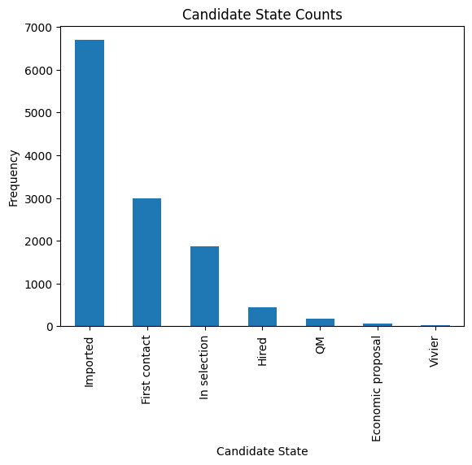

- **Age Range**:

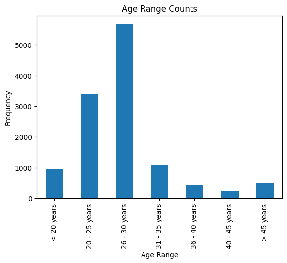

- **Residence**: we can use mapping to simplify this feature

.. code:: python

    print(df['Residence'].unique())

.. parsed-literal::

    ['TURIN » Turin ~ Piedmont' 'CONVERSANO » Bari ~ Puglia'
     'CASERTA » Caserta ~ Campania' ...
     'SAN FELICE A CANCELLO » Caserta ~ Campania'
     'PERDIFUMO » Salerno ~ Campania'
     'PALMANOVA » Udine ~ Friuli Venezia Giulia']

.. code:: python

    def map_residence(value):
        for region in italy_list:
            if region in value:
              return region
        for state in state_list:
            if state in value:
              return state
        return 'Not Specified'

.. code:: python

    df['Residence'] = df['Residence'].apply(map_residence)
    df['Residence'] = df['Residence'].replace('Türkiye', 'TURKEY')
    df['Residence'] = df['Residence'].replace('USSR', 'RUSSIAN FEDERATION')

We can add 3 new columns to the dataset: ``Residence State``,
``Residence Italian Region``, ``European Residence``. This kind of
information needs to be protected but should also be analyzed in order
to ensure *Fairness*.

.. code:: python

    df['Residence State'] = df['Residence'].apply(lambda x: x if x in state_list else 'ITALY')

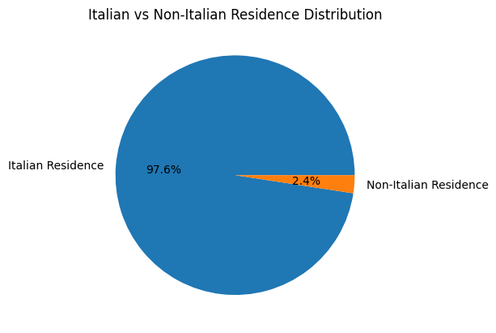

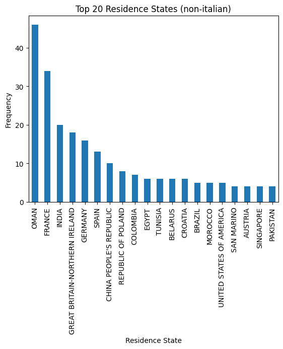

.. code:: python

    df['Residence Italian Region'] = df['Residence'].apply(lambda x: x if x in italy_list else 'Not in ITALY')

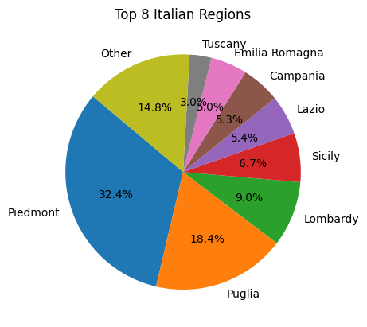

.. code:: python

    european_countries = [
        'ALBANIA', 'AUSTRIA', 'BELARUS', 'BELGIUM', 'BULGARIA', 'CROATIA', 'CZECH REPUBLIC',
        'FRANCE', 'GERMANY', 'GREAT BRITAIN-NORTHERN IRELAND', 'GREECE', 'ITALY', 'LATVIA',
        'LITHUANIA', 'LUXEMBOURG', 'MALTA', 'MOLDOVA', 'MONACO', 'MONTENEGRO', 'NETHERLANDS',
        'NORWAY', 'POLAND', 'PORTUGAL', 'ROMANIA', 'RUSSIA', 'SAN MARINO', 'SERBIA', 'SLOVAKIA',
        'SLOVENIA', 'SPAIN', 'SWEDEN', 'SWITZERLAND', 'UKRAINE'
    ]
    df['European Residence'] = df['Residence State'].apply(lambda x: 'Yes' if x in european_countries else 'No')

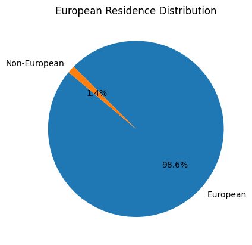

The ``Residence`` column can be removed.

- **Sex**: the dataset is unbalanced with respect to the Sex feature,
  with 76.8% Male candidates and 23.2% female candidates.

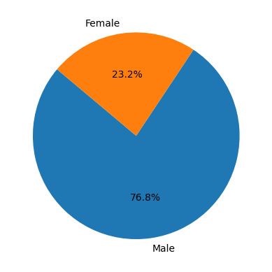

- **Protected Category**: the dataset is highly unbalanced with respect
  to the Protected Category feature, with only 0.4% candidates from
  protected categories.

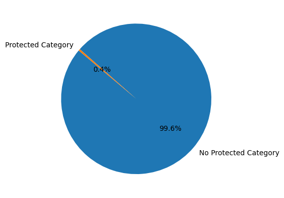

- **Tag**:

.. code:: python

    print(df['Tag'].unique())

.. parsed-literal::

    ['AUTOSAR, CAN, C, C++, MATLAB/SIMULINK, VECTOR/VENUS, VHDL, FPGA'
     '-, C, C++, DO178, LABVIEW, SOFTWARE DEVELOPMENT' 'PROCESS ENG.' ...
     '-, SOLIDWORKS, NX, CREO, INENTOR, GT POWER, AMESIM' 'SQL, UNIX'
     '-, ENVIRONMENTAL QUALITY, ENVIRONMENTAL MANAGER, ENVIRONMENTAL PROJECT ENGINEER, ISO 14001, ENVIRONMENTAL MANAGEMENT , ISO 14001, ENVIRONMENTAL MANAGEMENT, OFFSHORE']

.. raw:: html

    
      

        

    
    <table border="1" class="dataframe">
      <thead>
        <tr style="text-align: right;">
          <th></th>
          <th>Keyword</th>
          <th>Count</th>
        </tr>
      </thead>
      <tbody>
        <tr>
          <th>20</th>
          <td>MATLAB</td>
          <td>576</td>
        </tr>
        <tr>
          <th>3</th>
          <td>C++</td>
          <td>312</td>
        </tr>
        <tr>
          <th>2</th>
          <td>C</td>
          <td>305</td>
        </tr>
        <tr>
          <th>21</th>
          <td>SIMULINK</td>
          <td>305</td>
        </tr>
        <tr>
          <th>106</th>
          <td>SOLIDWORKS</td>
          <td>299</td>
        </tr>
        <tr>
          <th>35</th>
          <td>PYTHON</td>
          <td>275</td>
        </tr>
        <tr>
          <th>136</th>
          <td>EXCEL</td>
          <td>177</td>
        </tr>
        <tr>
          <th>51</th>
          <td>JAVA</td>
          <td>176</td>
        </tr>
        <tr>
          <th>135</th>
          <td>OFFICE</td>
          <td>143</td>
        </tr>
        <tr>
          <th>204</th>
          <td>AUTOCAD</td>
          <td>129</td>
        </tr>
      </tbody>
    </table>
    

        

    
      

        <button class="colab-df-convert" onclick="convertToInteractive('df-67afdbb0-075c-4efa-a153-dac386997efd')"
                title="Convert this dataframe to an interactive table."
                style="display:none;">
    
      <svg xmlns="http://www.w3.org/2000/svg" height="24px" viewBox="0 -960 960 960">
        <path d="M120-120v-720h720v720H120Zm60-500h600v-160H180v160Zm220 220h160v-160H400v160Zm0 220h160v-160H400v160ZM180-400h160v-160H180v160Zm440 0h160v-160H620v160ZM180-180h160v-160H180v160Zm440 0h160v-160H620v160Z"/>
      </svg>
        </button>
    
      
    
        
      

    
    
    

      <button class="colab-df-quickchart" onclick="quickchart('df-3f97a9eb-93c7-4d90-a9b2-31b6401acaab')"
                title="Suggest charts"
                style="display:none;">
    
    <svg xmlns="http://www.w3.org/2000/svg" height="24px"viewBox="0 0 24 24"
         width="24px">
        <g>
            <path d="M19 3H5c-1.1 0-2 .9-2 2v14c0 1.1.9 2 2 2h14c1.1 0 2-.9 2-2V5c0-1.1-.9-2-2-2zM9 17H7v-7h2v7zm4 0h-2V7h2v10zm4 0h-2v-4h2v4z"/>
        </g>
    </svg>
      </button>
    
    
    
      
    

    
        

      

.. code:: python

    keyword_df.head(20).plot(x='Keyword', y='Count', kind='bar', legend=False)
    plt.title('Top 20 Keywords')
    plt.ylabel('Frequency')
    plt.xlabel('Keyword')
    plt.show()

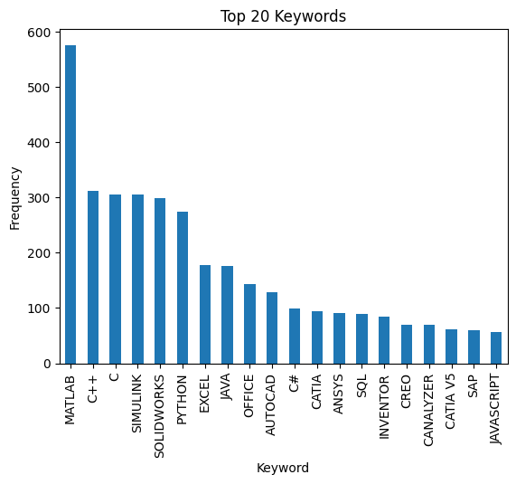

- **Study Area**:

.. code:: python

    print(df['Study Area'].unique())

.. parsed-literal::

    ['Automation/Mechatronics Engineering' 'computer engineering'
     'chemical engineering' 'Legal' 'Mechanical engineering'
     'Telecommunications Engineering' 'Economic - Statistics'
     'Materials Science and Engineering' 'Other scientific subjects'
     'Biomedical Engineering' 'electronic Engineering'
     'Information Engineering'
     'Aeronautical/Aerospace/Astronautics Engineering'
     'Energy and Nuclear Engineering' 'Informatics' 'Management Engineering'
     'Automotive Engineering' 'industrial engineering' 'Other' 'Surveyor'
     'Electrical Engineering' 'Scientific maturity' 'Chemist - Pharmaceutical'
     'Political-Social' 'Other humanities subjects' 'Geo-Biological'
     'Civil/Civil and Environmental Engineering' 'Psychology' 'Linguistics'
     'Agriculture and veterinary' 'Literary' 'Humanistic high school diploma'
     'Accounting' 'Communication Sciences' 'Safety Engineering' 'Architecture'
     'Mathematics' 'construction Engineering' 'Petroleum Engineering'
     'Naval Engineering' 'Artistic' 'Not Specified'
     'Mathematical-physical modeling for engineering'
     'Engineering for the environment and the territory' 'Medical'
     'Defense and Security' 'Physical education' 'Statistics']

.. code:: python

    study_areas_counts = Counter(df['Study Area'])
    
    study_areas_counts_df = pd.DataFrame(study_areas_counts.items(), columns=['Study Area', 'Count'])
    study_areas_counts_df = study_areas_counts_df.sort_values(by='Count', ascending=False)
    
    study_areas_counts_df.head(10)

.. raw:: html

    
      

        

    
    <table border="1" class="dataframe">
      <thead>
        <tr style="text-align: right;">
          <th></th>
          <th>Study Area</th>
          <th>Count</th>
        </tr>
      </thead>
      <tbody>
        <tr>
          <th>4</th>
          <td>Mechanical engineering</td>
          <td>2235</td>
        </tr>
        <tr>
          <th>1</th>
          <td>computer engineering</td>
          <td>1344</td>
        </tr>
        <tr>
          <th>12</th>
          <td>Aeronautical/Aerospace/Astronautics Engineering</td>
          <td>951</td>
        </tr>
        <tr>
          <th>9</th>
          <td>Biomedical Engineering</td>
          <td>924</td>
        </tr>
        <tr>
          <th>17</th>
          <td>industrial engineering</td>
          <td>901</td>
        </tr>
        <tr>
          <th>15</th>
          <td>Management Engineering</td>
          <td>798</td>
        </tr>
        <tr>
          <th>10</th>
          <td>electronic Engineering</td>
          <td>685</td>
        </tr>
        <tr>
          <th>18</th>
          <td>Other</td>
          <td>567</td>
        </tr>
        <tr>
          <th>11</th>
          <td>Information Engineering</td>
          <td>485</td>
        </tr>
        <tr>
          <th>0</th>
          <td>Automation/Mechatronics Engineering</td>
          <td>430</td>
        </tr>
      </tbody>
    </table>
    

        

    
      

        <button class="colab-df-convert" onclick="convertToInteractive('df-d8e21451-d929-49dd-901c-c2c0cd421a30')"
                title="Convert this dataframe to an interactive table."
                style="display:none;">
    
      <svg xmlns="http://www.w3.org/2000/svg" height="24px" viewBox="0 -960 960 960">
        <path d="M120-120v-720h720v720H120Zm60-500h600v-160H180v160Zm220 220h160v-160H400v160Zm0 220h160v-160H400v160ZM180-400h160v-160H180v160Zm440 0h160v-160H620v160ZM180-180h160v-160H180v160Zm440 0h160v-160H620v160Z"/>
      </svg>
        </button>
    
      
    
        
      

    
    
    

      <button class="colab-df-quickchart" onclick="quickchart('df-33aa489a-160d-4d3e-8fe8-5425d088307d')"
                title="Suggest charts"
                style="display:none;">
    
    <svg xmlns="http://www.w3.org/2000/svg" height="24px"viewBox="0 0 24 24"
         width="24px">
        <g>
            <path d="M19 3H5c-1.1 0-2 .9-2 2v14c0 1.1.9 2 2 2h14c1.1 0 2-.9 2-2V5c0-1.1-.9-2-2-2zM9 17H7v-7h2v7zm4 0h-2V7h2v10zm4 0h-2v-4h2v4z"/>
        </g>
    </svg>
      </button>
    
    
    
      
    

    
        

      

.. code:: python

    study_areas_counts_df.head(20).plot(x='Study Area', y='Count', kind='bar', legend=False)
    plt.title('Top 20 Study Areas')
    plt.ylabel('Frequency')
    plt.xlabel('Study Area')
    plt.show()

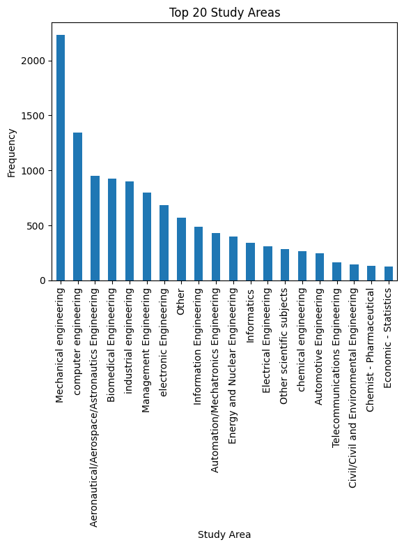

- **Study Title**:

.. code:: python

    study_title_distrib = df['Study Title'].value_counts()
    study_title_df = pd.DataFrame(study_title_distrib.items(), columns=['Study Title', 'Count'])
    study_title_df.plot(x='Study Title', y='Count', kind='bar', legend=False)

.. parsed-literal::

    <Axes: xlabel='Study Title'>

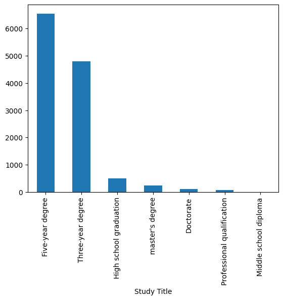

- **Years Experience**:

.. code:: python

    print(df['Years Experience'].unique())

.. parsed-literal::

    ['[1-3]' '[7-10]' '[3-5]' '[5-7]' '[+10]' '[0]' '[0-1]']

.. code:: python

    custom_order = ['[0]', '[0-1]', '[1-3]', '[3-5]', '[5-7]', '[7-10]', '[+10]']
    df['Years Experience'] = pd.Categorical(df['Years Experience'], categories=custom_order, ordered=True)
    
    years_exp_counts = Counter(df['Years Experience'].sort_values())
    years_exp_df = pd.DataFrame(years_exp_counts.items(), columns=['Years Experience', 'Count'])
    years_exp_df.plot(x='Years Experience', y='Count', kind='bar', legend=False)
    plt.title('Years Experience Counts')
    plt.ylabel('Frequency')

.. parsed-literal::

    Text(0, 0.5, 'Frequency')

.. image:: Akkodis_Documentation_files/Akkodis_Documentation_62_1.png

- **Sector**: this feature doesn’t seem relevant as the most frequent
  values are “Not Specified” and “Others”

.. code:: python

    sector_counts = Counter(df['Sector'])
    sector_df = pd.DataFrame(sector_counts.items(), columns=['Sector', 'Count'])
    sector_df = sector_df.sort_values(by='Count', ascending=False)
    sector_df.plot(x='Sector', y='Count', kind='bar', legend=False)
    plt.title('Sector Counts')
    plt.ylabel('Frequency')
    plt.show()

- \**Event_type\__val*\*:

.. code:: python

    print(df['Event_Type__Val'].unique())

.. parsed-literal::

    ['BM interview' 'Candidate notification' 'Qualification Meeting'
     'Technical interview' 'HR interview' 'CV request' 'Contact note'
     'Inadequate CV' 'Economic proposal' 'Research association'
     'Sending SC to customer' 'Not Specified' 'Commercial note']

.. code:: python

    etv_distrib = Counter(df['Event_Type__Val'])
    etv_distrib_df = pd.DataFrame(etv_distrib.items(), columns=['Event_Type__Val', 'Count'])
    etv_distrib_df = etv_distrib_df.sort_values(by='Count', ascending=False)
    etv_distrib_df.plot(x='Event_Type__Val', y='Count', kind='bar', legend=False)
    plt.title('Event Type Counts')
    plt.ylabel('Frequency')
    plt.show()

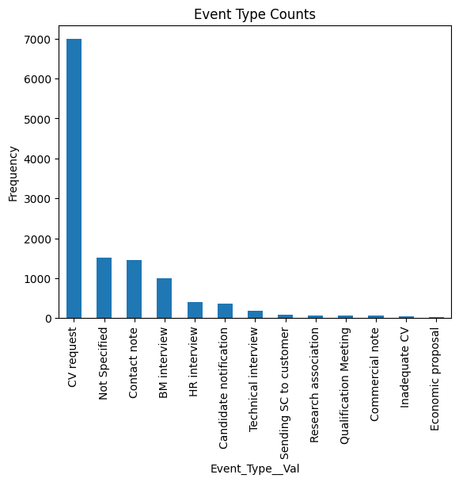

- **Event_feedback**:

.. code:: python

    ok_ko_distrib = df['Event_Feedback'].value_counts()
    ok_ko_distrib_df = pd.DataFrame(ok_ko_distrib.items(), columns=['Event_Feedback', 'Count'])
    
    ok_ko_distrib = ok_ko_distrib_df['Count']
    labels = ok_ko_distrib_df['Event_Feedback']
    
    plt.pie(ok_ko_distrib, labels=labels, autopct='%1.1f%%')
    plt.title('Event Feedback Distribution')
    plt.show()

.. image:: Akkodis_Documentation_files/Akkodis_Documentation_69_0.png

Data Visualization
------------------

Sex & Candidate State
~~~~~~~~~~~~~~~~~~~~~

.. code:: python

    pivot = df.pivot_table(index='Sex', columns='Candidate State', aggfunc='size', fill_value=0)
    
    pivot.plot(kind='bar', figsize=(10, 6))
    plt.title('Candidate State by Sex')
    plt.ylabel('Count')
    plt.xlabel('Sex')
    plt.legend(title='Candidate State', bbox_to_anchor=(1.05, 1), loc='upper left')
    plt.tight_layout()
    plt.show()

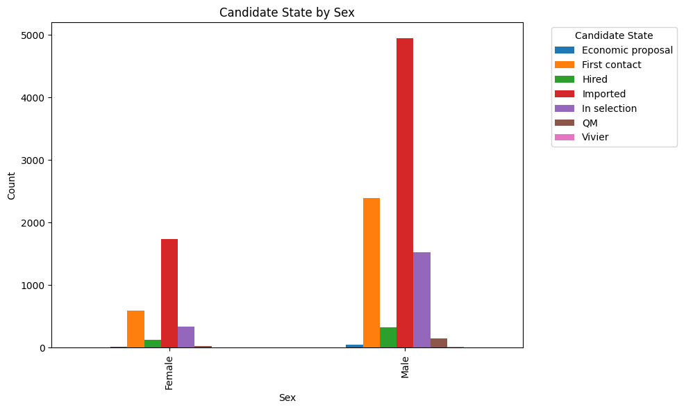

.. code:: python

    # Normalize pivot table to percentages
    pivot_percentage = pivot.div(pivot.sum(axis=1), axis=0)
    
    pivot_percentage.plot(kind='bar', stacked=True, figsize=(10, 6))
    plt.title('Candidate State by Sex (Normalized)')
    plt.ylabel('Proportion')
    plt.xlabel('Sex')
    plt.legend(title='Candidate State', bbox_to_anchor=(1.05, 1), loc='upper left')
    plt.tight_layout()
    plt.show()

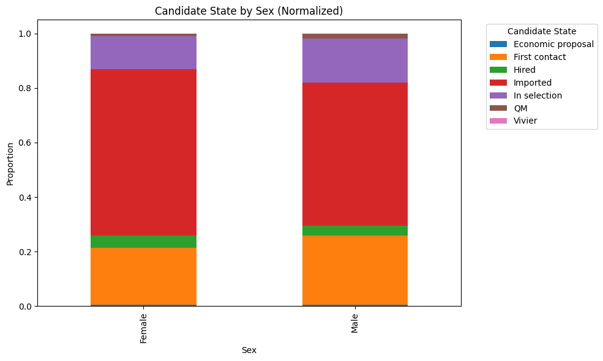

###Protected Category & Candidate State

.. code:: python

    pivot = df.pivot_table(index='Protected Category', columns='Candidate State', aggfunc='size', fill_value=0)
    pivot_percentage = pivot.div(pivot.sum(axis=1), axis=0)
    
    pivot_percentage.plot(kind='bar', stacked=True, figsize=(10, 6))
    plt.title('Candidate State by Protected Category (Normalized)')
    plt.ylabel('Proportion')
    plt.xlabel('Protected Category')
    plt.legend(title='Candidate State', bbox_to_anchor=(1.05, 1), loc='upper left')
    plt.tight_layout()
    plt.show()

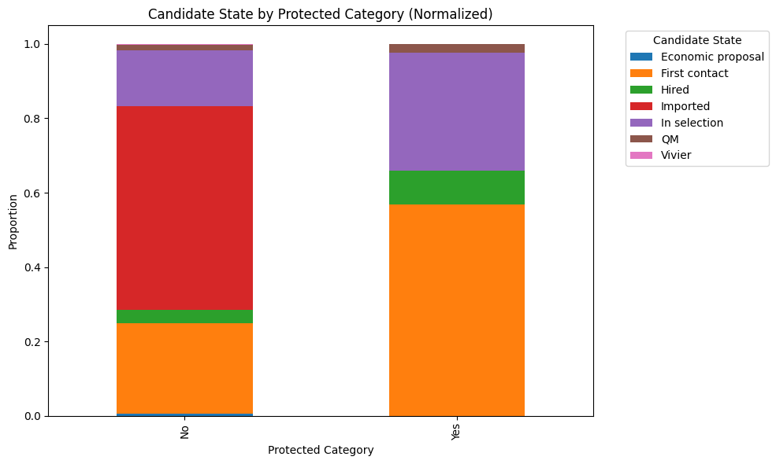

.. code:: python

    print(df.columns)

.. parsed-literal::

    Index(['Candidate State', 'Age Range', 'Sex', 'Protected Category', 'Tag',
           'Study Area', 'Study Title', 'Years Experience', 'Sector',
           'Event_Type__Val', 'Event_Feedback', 'Residence State',
           'Residence Italian Region', 'European Residence'],
          dtype='object')

Distribution of Age Ranges
~~~~~~~~~~~~~~~~~~~~~~~~~~

.. code:: python

    plt.figure(figsize=(12, 6))
    sns.histplot(
        data= df,
        x='Age Range',
        hue='Candidate State',
        multiple='stack',
        palette='Set2',
        shrink=0.8
    )
    plt.title("Distribution of Age Ranges by Candidate State", fontsize=14)
    plt.xlabel("Age Range", fontsize=12)
    plt.ylabel("Count", fontsize=12)
    plt.xticks(rotation=45)
    plt.legend(title='Candidate State', bbox_to_anchor=(1.05, 1), loc='upper left')
    plt.tight_layout()
    plt.show()
    
    
    plt.figure(figsize=(12, 6))
    sns.boxplot(
        data=df,
        x='Candidate State',
        y=df['Age Range'].map(lambda x: int(x.split('-')[0]) if '-' in x else (19 if '<' in x else 46)),
        palette='Set3'
    )
    plt.title("Candidate State by Age Range (Numerical Approximation)", fontsize=14)
    plt.xlabel("Candidate State", fontsize=12)
    plt.ylabel("Age Range (Approximate Numerical Value)", fontsize=12)
    plt.xticks(rotation=45)
    plt.tight_layout()
    plt.show()

.. parsed-literal::

    WARNING:matplotlib.legend:No artists with labels found to put in legend.  Note that artists whose label start with an underscore are ignored when legend() is called with no argument.

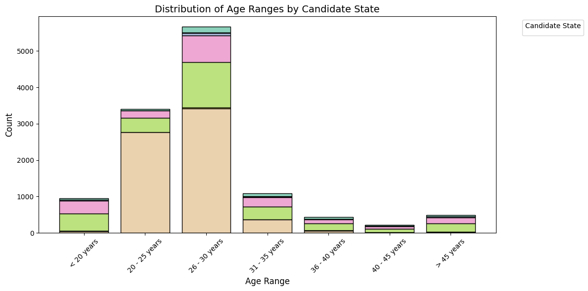

.. parsed-literal::

    <ipython-input-210-b2f861d90bfc>:20: FutureWarning: 
    
    Passing `palette` without assigning `hue` is deprecated and will be removed in v0.14.0. Assign the `x` variable to `hue` and set `legend=False` for the same effect.
    
      sns.boxplot(

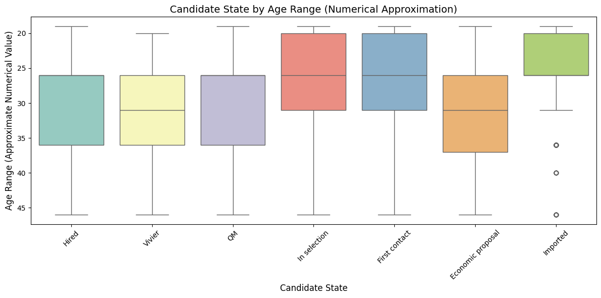

