Dataset Analysis for AKKODIS
============================

.. contents:: Table of Contents
   :depth: 2
   :local:
   :backlinks: none

Overview
--------

The Akkodis Dataset consists of 40 columns and 21,277 entries. Each
candidate is identified by its ``ID`` and can appear in more than one
row, each one specific for an ``Event_type__val``.

Dataset Description
-------------------

Features
~~~~~~~~

- **ID**: unique identifier for the candidate
- **Candidate State**: status of the candidate’s application

  - ``Hired``: the candidate has been selected
  - ``Vivier``: the candidate will be taken in consideration for future
    opportunities
  - ``QM``: *Qualification Meeting* ??
  - ``In selection``: selection phase
  - ``First contact``: the candidate has been contacted from the company
    for the first time
  - ``Economic proposal``: the company has made a proposal to the
    candidate
  - ``Imported``: the candidate has been transfered from another DB ??

- **Age Range**: range of age for the candidate

  - ``< 20`` years
  - ``20 - 25`` years
  - ``26 - 30`` years
  - ``31 - 35`` years
  - ``36 - 40`` years
  - ``40 - 45`` years
  - ``> 45`` years

- **Residence**: current place of residence for the candidate
- **Sex**: gender identification (``Male|Female``)
- **Protected Category**: indicates if the candidate falls into a
  protected category

  - ``Article 1``
  - ``Article 18``
  - Not Specified

- **TAG**: keywords used by recruiter
- **Study Area**: Field of study or academic discipline
- **Study Title**: Academic degree or title obtained

  - ``Five-year degree``
  - ``Doctorate``
  - ``High school graduation``
  - ``Three-year degree``
  - ``master's degree``
  - ``Professional qualification``
  - ``Middle school diploma``

- **Years Experience**: number of years of professional experience

  - ``0``
  - ``0-1``
  - ``1-3``
  - ``3-5``
  - ``5-7``
  - ``7-10``
  - ``+10``

- **Sector**: industry or sector in which the candidate has experience
- **Last Role**: candidate’s most recent job role
- **Year of Insertion**: year when the candidate’s information was
  entered into the portal
- **Year of Recruitment**: year in which the candidate was hired
- **Recruitment Request**: represents the application request for a
  candidacy
- **Assumption Headquarters**: headquarters location associated with the
  hiring assumption
- **Job Family Hiring**: Job family or category for the hiring position
- **Job Title Hiring**: specific job title for the hiring position
- **Event_type__val**: It specifies the stage of the recruitment
  process for the candidate
- **Event_feedback**: feedback received from an event (``OK|KO``)
- **Linked_search_key**: keys indicate the number of searches conducted
  for a job position
- **Overall**: overall assessment, interview score

  - ``1 - Low`` or ``~ 1 - Low``
  - ``2 - Medium`` or ``~ 2 - Medium``
  - ``3 - High`` or ``~ 3 - High``
  - ``4 - Top`` or ``~ 4 - Top``

- **Job Description**: description of the job role
- **Candidate Profile**: ideal profile information for the candidate,
  requested by the company
- **Years Experience.1**: additional field for specifying years of
  experience requested
- **Minimum Ral** (Gross Annual Salary): minimum expected gross annual
  salary
- **Ral Maximum**: maximum expected gross annual salary
- **Study Level**: level of study requested for the job position, the
  values are equivalent to ``Study Title``
- **Study Area.1**: additional field for specifying the academic field
  of study requested
- **Akkodis headquarters**: headquarters location for Akkodis
- **Current Ral**: current or existing salary
- **Expected Ral**: expected salary
- **Technical Skills**: skills related to technical or specialized
  expertise from 1 to 4
- **Standing/Position**: standing or position within the organization
  from 1 to 4
- **Comunication**: communication skills from 1 to 4
- **Maturity**: level of maturity from 1 to 4
- **Dynamism**: level of Dynamism from 1 to 4
- **Mobility**: mobility from 1 to 4
- **English**: proficiency in the English language from 1 to 4

Possible Target Variables
~~~~~~~~~~~~~~~~~~~~~~~~~

Some possible target variables in this dataset could be: 

- **Suitability**: a new column that defines if a candidate is suitable for the position, based on the information provided.
- **Possible RAL**: a new column that predicts the adequate RAL for the candidate profile.

However the dataset contains very few samples with RAL values specified:

.. parsed-literal::

    94.53% of samples have no Minimum Ral specified
    92.85% of samples have no Ral Maximum specified
    80.56% of samples have no Current Ral specified
    80.73% of samples have no Expected Ral specified

The **suitability** of a candidate could be obtained through
``Candidate State`` and ``Event_Feedback``. However the 2 columns don’t
seem to be always consistent as we can find samples with both ``Hired``
as *Candidate State* and ``KO`` as *Event_feedback*:

.. parsed-literal::

             Candidate State        Event_Type__Val              Event_Feedback
    13                    QM  Qualification Meeting       KO (technical skills)
    87                 Hired    Technical interview     KO (opportunity closed)
    112                Hired    Technical interview  KO (proposed renunciation)
    122    Economic proposal      Economic proposal  KO (proposed renunciation)
    141         In selection           BM interview                KO (manager)
    ...                  ...                    ...                         ...
    21281       In selection           HR interview       KO (technical skills)
    21300  Economic proposal      Economic proposal  KO (proposed renunciation)
    21315       In selection           HR interview                KO (manager)
    21316       In selection           BM interview                KO (manager)
    21336       In selection           HR interview                KO (retired)
    
    [854 rows x 3 columns]

Data Cleaning
--------------
Duplicates
~~~~~~~~~~

Each candidate has more than one row in the dataset, one for each
``Event_type__val``. We need to select the most recent one and remove
the other ones to guarantee consistency. We could assume the last row
for each ``ID`` to be the most recent one.

.. code:: python

    df_nodup = df.drop_duplicates(subset='Id', keep='last')

This however reduces drastically the number of samples in the dataset,
from 21 377 to 12 263 rows, removing the 43% of the whole dataset.

.. parsed-literal::

    42.63% of the dataset were duplicates

Unuseful Columns
~~~~~~~~~~~~~~~~

Some columns might be unuseful such as ``ID``, ``Year Of Insertion``,
``Linked_Search__Key`` …

.. code:: python

    columns_to_drop = ['Id', 'Last Role', 'Year Of Insertion',
                       'Assumption Headquarters', 'Linked_Search__Key',
                       'Akkodis Headquarters']

Some features are often not specified so filling with *default values*
might not be the right choice. A **threshold** could be set to select
the columns to drop. For example features specified in less than 40% of
the samples could be considered unuseful.

.. parsed-literal::

    <Id> null count: 0.00%
    <Candidate State> null count: 0.00%
    <Age Range> null count: 0.00%
    <Residence> null count: 0.01%
    <Sex> null count: 0.00%
    <Protected Category> null count: 99.60%
    <Tag> null count: 50.19%
    <Study Area> null count: 0.21%
    <Study Title> null count: 0.00%
    <Years Experience> null count: 0.00%
    <Sector> null count: 42.86%
    <Last Role> null count: 42.86%
    <Year Of Insertion> null count: 0.00%
    <Year Of Recruitment> null count: 88.82%
    <Recruitment Request> null count: 90.20%
    <Assumption Headquarters> null count: 88.86%
    <Job Family Hiring> null count: 88.86%
    <Job Title Hiring> null count: 88.86%
    <Event_Type__Val> null count: 7.44%
    <Event_Feedback> null count: 72.65%
    <Linked_Search__Key> null count: 70.41%
    <Overall> null count: 72.01%
    <Job Description> null count: 90.09%
    <Candidate Profile> null count: 90.22%
    <Years Experience.1> null count: 90.08%
    <Minimum Ral> null count: 94.53%
    <Ral Maximum> null count: 92.85%
    <Study Level> null count: 90.08%
    <Study Area.1> null count: 90.08%
    <Akkodis Headquarters> null count: 90.08%
    <Current Ral> null count: 80.56%
    <Expected Ral> null count: 80.73%
    <Technical Skills> null count: 72.14%
    <Standing/Position> null count: 72.05%
    <Comunication> null count: 72.08%
    <Maturity> null count: 72.10%
    <Dynamism> null count: 72.10%
    <Mobility> null count: 72.05%
    <English> null count: 72.19%

.. code:: python

    df = df_nodup.drop(columns=columns_to_drop)

.. parsed-literal::

    The remaining columns are:
    
    Index(['Candidate State', 'Age Range', 'Residence', 'Sex',
           'Protected Category', 'Tag', 'Study Area', 'Study Title',
           'Years Experience', 'Sector', 'Event_Type__Val', 'Event_Feedback'],
          dtype='object')

NaNs Handling
~~~~~~~~~~~~~

There are still many columns left with no values specified.

.. parsed-literal::

    Columns that contain NaN values:
     ['Residence', 'Protected Category', 'Tag', 'Study Area', 'Sector', 'Event_Type__Val', 'Event_Feedback']

In order to define *default values* we need to analyze each feature:

.. parsed-literal::

    Residence values: ['TURIN » Turin ~ Piedmont' 'CONVERSANO » Bari ~ Puglia'
     'CASERTA » Caserta ~ Campania' ...
     'SAN FELICE A CANCELLO » Caserta ~ Campania'
     'PERDIFUMO » Salerno ~ Campania'
     'PALMANOVA » Udine ~ Friuli Venezia Giulia'] 
    
    Protected Category values: [nan 'Article 1' 'Article 18'] 
    
    Tag values: ['AUTOSAR, CAN, C, C++, MATLAB/SIMULINK, VECTOR/VENUS, VHDL, FPGA'
     '-, C, C++, DO178, LABVIEW, SOFTWARE DEVELOPMENT' 'PROCESS ENG.' ...
     '-, SOLIDWORKS, NX, CREO, INENTOR, GT POWER, AMESIM' 'SQL, UNIX'
     '-, ENVIRONMENTAL QUALITY, ENVIRONMENTAL MANAGER, ENVIRONMENTAL PROJECT ENGINEER, ISO 14001, ENVIRONMENTAL MANAGEMENT , ISO 14001, ENVIRONMENTAL MANAGEMENT, OFFSHORE'] 
    
    Study Area values: ['Automation/Mechatronics Engineering' 'computer engineering'
     'chemical engineering' 'Legal' 'Mechanical engineering'
     'Telecommunications Engineering' 'Economic - Statistics'
     'Materials Science and Engineering' 'Other scientific subjects'
     'Biomedical Engineering' 'electronic Engineering'
     'Information Engineering'
     'Aeronautical/Aerospace/Astronautics Engineering'
     'Energy and Nuclear Engineering' 'Informatics' 'Management Engineering'
     'Automotive Engineering' 'industrial engineering' 'Other' 'Surveyor'
     'Electrical Engineering' 'Scientific maturity' 'Chemist - Pharmaceutical'
     'Political-Social' 'Other humanities subjects' 'Geo-Biological'
     'Civil/Civil and Environmental Engineering' 'Psychology' 'Linguistics'
     'Agriculture and veterinary' 'Literary' 'Humanistic high school diploma'
     'Accounting' 'Communication Sciences' 'Safety Engineering' 'Architecture'
     'Mathematics' 'construction Engineering' 'Petroleum Engineering'
     'Naval Engineering' 'Artistic' nan
     'Mathematical-physical modeling for engineering'
     'Engineering for the environment and the territory' 'Medical'
     'Defense and Security' 'Physical education' 'Statistics'] 
    
    Sector values: ['Automotive' 'Aeronautics' 'Consulting' 'Telecom' 'Others' 'Space'
     'Life sciences' nan 'Railway' 'Defence' 'Naval'
     'Services and Information Systems' 'Energy' 'Machining - Heavy Industry'
     'Oil and Gas'] 
    
    Event_Type__Val values: ['BM interview' 'Candidate notification' 'Qualification Meeting'
     'Technical interview' 'HR interview' 'CV request' 'Contact note'
     'Inadequate CV' 'Economic proposal' 'Research association'
     'Sending SC to customer' nan 'Commercial note'] 
    
    Event_Feedback values: ['OK' nan 'KO (technical skills)' 'OK (waiting for departure)'
     'KO (proposed renunciation)' 'OK (live)' 'KO (mobility)' 'KO (manager)'
     'KO (retired)' 'OK (hired)' 'KO (seniority)' 'KO (ral)'
     'OK (other candidate)' 'KO (opportunity closed)' 'KO (lost availability)'
     'KO (language skills)'] 
    

Some default values could be:

.. code:: python

    df['Residence'] = df['Residence'].fillna('Not Specified')
    
    df['Protected Category'] = df['Protected Category'].fillna('No')
    
    df['Tag'] = df['Tag'].fillna('Not Specified')
    
    df['Study Area'] = df['Study Area'].fillna('Not Specified')
    
    df['Sector'] = df['Sector'].fillna('Not Specified')
    
    df['Event_Type__Val'] = df['Event_Type__Val'].fillna('Not Specified')
    
    df['Event_Feedback'] = df['Event_Feedback'].fillna('Not Specified')

Feature Mapping
~~~~~~~~~~~~~~~

Feature mapping can be used to simplify the values in the dataset.

Let’s analyze each feature:

**Candidate State**
^^^^^^^^^^^^^^^^^^^

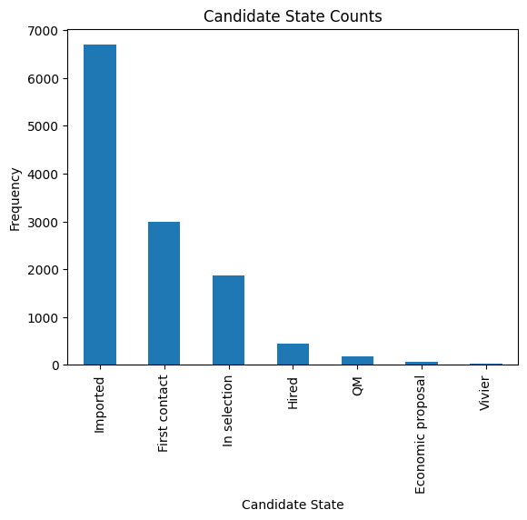

**Age Range**
^^^^^^^^^^^^^

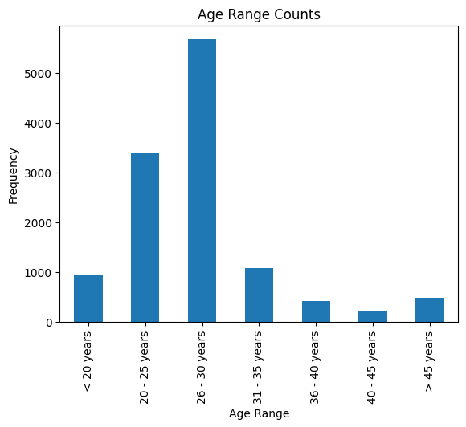

**Residence**
^^^^^^^^^^^^^

Mapping can be used to simplify this feature.

.. parsed-literal::

    ['TURIN » Turin ~ Piedmont' 'CONVERSANO » Bari ~ Puglia'
     'CASERTA » Caserta ~ Campania' ...
     'SAN FELICE A CANCELLO » Caserta ~ Campania'
     'PERDIFUMO » Salerno ~ Campania'
     'PALMANOVA » Udine ~ Friuli Venezia Giulia']

.. parsed-literal::

    List of residence states of the candidates in the dataset:
     ['ALBANIA', 'ALGERIA', 'AUSTRIA', 'BELARUS', 'BELGIUM', 'BRAZIL', 'BULGARIA', 'CHILE', "CHINA PEOPLE'S REPUBLIC", 'COLOMBIA', 'CROATIA', 'CZECH REPUBLIC', 'EGYPT', 'ERITREA', 'FRANCE', 'GERMANY', 'GREAT BRITAIN-NORTHERN IRELAND', 'GREECE', 'GRENADA', 'HAITI', 'INDIA', 'INDONESIA', 'IRAN', 'ITALY', 'KUWAIT', 'LEBANON', 'LIBYA', 'LITHUANIA', 'MALAYSIA', 'MALTA', 'MEXICO', 'MONACO', 'MOROCCO', 'NETHERLANDS', 'NIGERIA', 'OMAN', 'PAKISTAN', 'PHILIPPINES', 'PORTUGAL', 'QATAR', 'REPUBLIC OF POLAND', 'ROMANIA', 'RUSSIAN FEDERATION', 'SAINT LUCIA', 'SAINT PIERRE ET MIQUELON (ISLANDS)', 'SAN MARINO', 'SERBIA AND MONTENEGRO', 'SINGAPORE', 'SLOVAKIA', 'SOUTH AFRICAN REPUBLIC', 'SPAIN', 'SRI LANKA', 'SWEDEN', 'SWITZERLAND', 'SYRIA', 'TONGA', 'TUNISIA', 'Türkiye', 'UKRAINE', 'UNITED ARAB EMIRATES', 'UNITED STATES OF AMERICA', 'USSR', 'UZBEKISTAN', 'VENEZUELA', 'YUGOSLAVIA']

.. parsed-literal::

    List of residence italian regions of the candidates in the dataset:
     ['Abruzzo', 'Aosta Valley', 'Basilicata', 'Calabria', 'Campania', 'Emilia Romagna', 'Friuli Venezia Giulia', 'Lazio', 'Liguria', 'Lombardy', 'Marche', 'Molise', 'Not Specified', 'Piedmont', 'Puglia', 'Sardinia', 'Sicily', 'Trentino Alto Adige', 'Tuscany', 'Umbria', 'Veneto']

.. code:: python

    def map_residence(value):
        for region in italy_list:
            if region in value:
              return region
        for state in state_list:
            if state in value:
              return state
        return 'Not Specified'

The values in the ``Residence`` column could be replaced with either the
*italian region* or the *state*.

.. code:: python

    df['Residence'] = df['Residence'].apply(map_residence)
    df['Residence'] = df['Residence'].replace('Türkiye', 'TURKEY')
    df['Residence'] = df['Residence'].replace('USSR', 'RUSSIAN FEDERATION')

To better define *residence* 3 new columns could be added:
``Residence State``, ``Residence Italian Region``,
``European Residence``. This kind of information needs to be protected
but should also be taken in consideration in order to ensure *Fairness*.

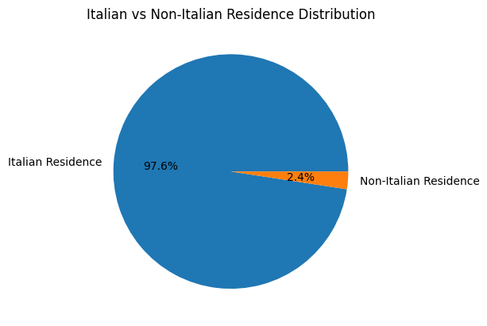

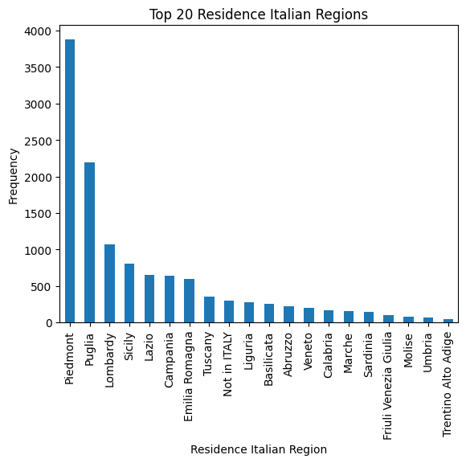

.. code:: python

    european_countries = [
        'ALBANIA', 'AUSTRIA', 'BELARUS', 'BELGIUM', 'BULGARIA', 'CROATIA', 'CZECH REPUBLIC',
        'FRANCE', 'GERMANY', 'GREAT BRITAIN-NORTHERN IRELAND', 'GREECE', 'ITALY', 'LATVIA',
        'LITHUANIA', 'LUXEMBOURG', 'MALTA', 'MOLDOVA', 'MONACO', 'MONTENEGRO', 'NETHERLANDS',
        'NORWAY', 'POLAND', 'PORTUGAL', 'ROMANIA', 'RUSSIA', 'SAN MARINO', 'SERBIA', 'SLOVAKIA',
        'SLOVENIA', 'SPAIN', 'SWEDEN', 'SWITZERLAND', 'UKRAINE'
    ]
    df['European Residence'] = df['Residence State'].apply(lambda x: 'Yes' if x in european_countries else 'No')

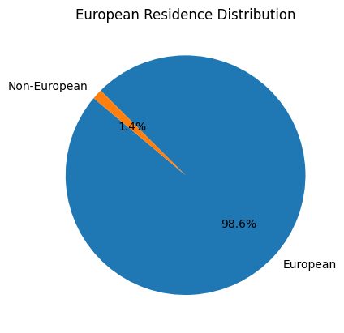

The ``Residence`` column could then be removed.

.. code:: python

    df = df.drop(columns=['Residence'])

**Sex**
^^^^^^^

The dataset is unbalanced with respect to the Sex feature, with 76.8%
male candidates and 23.2% female candidates.

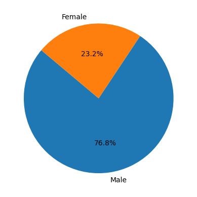

**Protected Category**
^^^^^^^^^^^^^^^^^^^^^^

Mapping can be applied to simplify this feature and discriminate between
candidates that are part of a protected category and candidates who are
not.

.. code:: python

    df['Protected Category'] = df['Protected Category'].replace('Article 18', 'Yes')
    df['Protected Category'] = df['Protected Category'].replace('Article 1', 'Yes')

The dataset is highly unbalanced with respect to this feature, with only
0.4% candidates from protected categories.

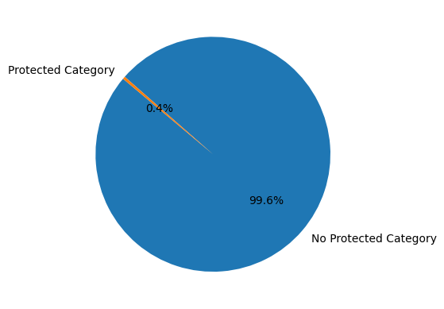

**Tag**
^^^^^^^

This feature is highly irregular and will need processing in order to be
useful. Some mapping could be applied to clean the data:

.. code:: python

    df['Tag'] = df['Tag'].replace('-', 'Not Specified')
    df['Tag'] = df['Tag'].replace('.', 'Not Specified')
    df['Tag'] = df['Tag'].replace('X', 'Not Specified')

.. parsed-literal::

    ['AUTOSAR, CAN, C, C++, MATLAB/SIMULINK, VECTOR/VENUS, VHDL, FPGA'
     '-, C, C++, DO178, LABVIEW, SOFTWARE DEVELOPMENT' 'PROCESS ENG.' ...
     '-, SOLIDWORKS, NX, CREO, INENTOR, GT POWER, AMESIM' 'SQL, UNIX'
     '-, ENVIRONMENTAL QUALITY, ENVIRONMENTAL MANAGER, ENVIRONMENTAL PROJECT ENGINEER, ISO 14001, ENVIRONMENTAL MANAGEMENT , ISO 14001, ENVIRONMENTAL MANAGEMENT, OFFSHORE']

**Study Area**
^^^^^^^^^^^^^^

.. parsed-literal::

    There are 48 different <Study Area> values:
     ['Automation/Mechatronics Engineering' 'computer engineering'
     'chemical engineering' 'Legal' 'Mechanical engineering'
     'Telecommunications Engineering' 'Economic - Statistics'
     'Materials Science and Engineering' 'Other scientific subjects'
     'Biomedical Engineering' 'electronic Engineering'
     'Information Engineering'
     'Aeronautical/Aerospace/Astronautics Engineering'
     'Energy and Nuclear Engineering' 'Informatics' 'Management Engineering'
     'Automotive Engineering' 'industrial engineering' 'Other' 'Surveyor'
     'Electrical Engineering' 'Scientific maturity' 'Chemist - Pharmaceutical'
     'Political-Social' 'Other humanities subjects' 'Geo-Biological'
     'Civil/Civil and Environmental Engineering' 'Psychology' 'Linguistics'
     'Agriculture and veterinary' 'Literary' 'Humanistic high school diploma'
     'Accounting' 'Communication Sciences' 'Safety Engineering' 'Architecture'
     'Mathematics' 'construction Engineering' 'Petroleum Engineering'
     'Naval Engineering' 'Artistic' 'Not Specified'
     'Mathematical-physical modeling for engineering'
     'Engineering for the environment and the territory' 'Medical'
     'Defense and Security' 'Physical education' 'Statistics'] 

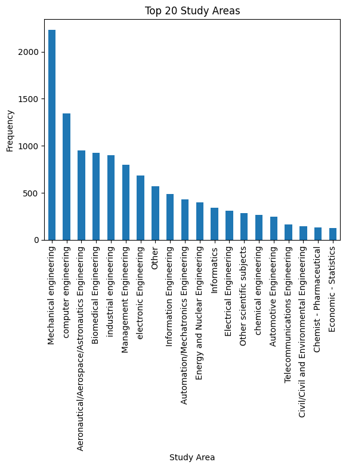

**Study Title**
^^^^^^^^^^^^^^^

.. parsed-literal::

    There are 7 different <Study Title> values:
     ['Five-year degree' 'Doctorate' 'High school graduation'
     'Three-year degree' "master's degree" 'Middle school diploma'
     'Professional qualification'] 

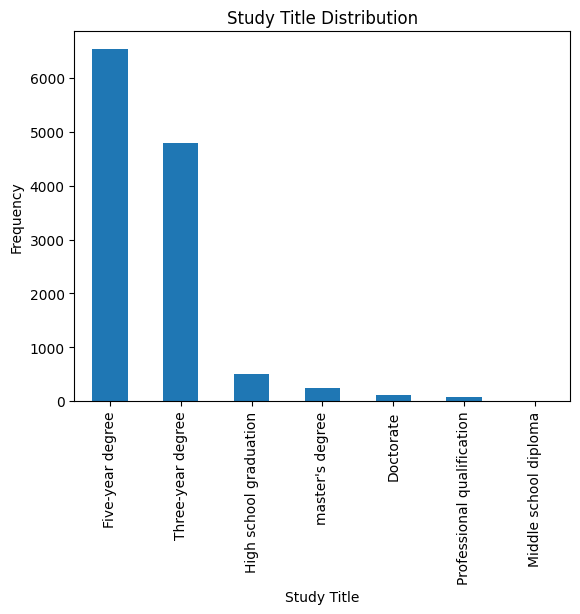

**Years Experience**
^^^^^^^^^^^^^^^^^^^^

.. parsed-literal::

    There are 7 different <Years Experience> categories:
     ['[1-3]' '[7-10]' '[3-5]' '[5-7]' '[+10]' '[0]' '[0-1]'] 

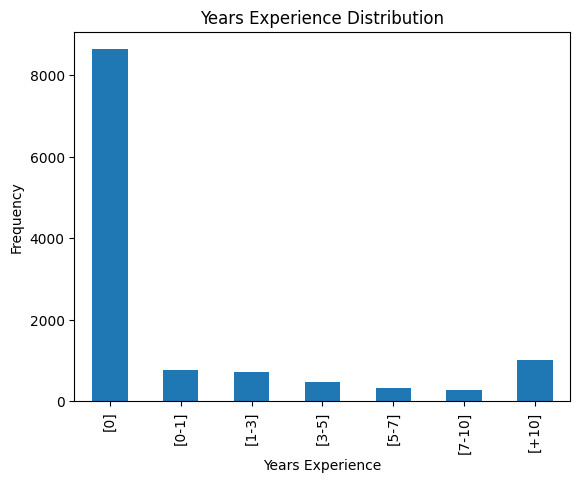

**Sector**
^^^^^^^^^^

This feature doesn’t seem relevant as its most frequent values are “*Not
Specified*” and “*Others*”.

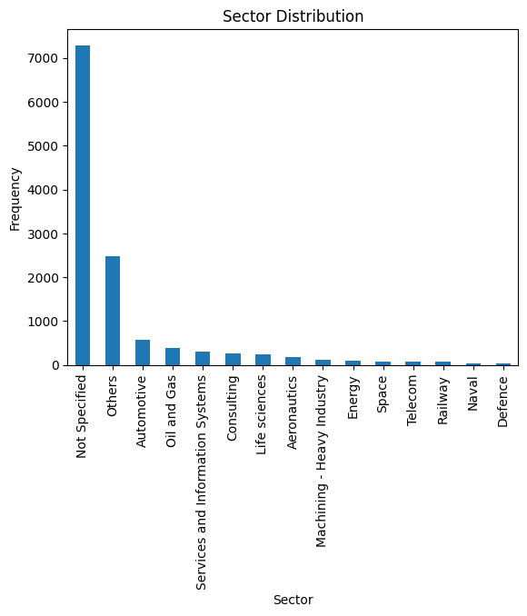

**Event_type__val**
^^^^^^^^^^^^^^^^^^^^^^

.. parsed-literal::

    There are 13 different values for <Event_Type__Val:
     ['BM interview' 'Candidate notification' 'Qualification Meeting'
     'Technical interview' 'HR interview' 'CV request' 'Contact note'
     'Inadequate CV' 'Economic proposal' 'Research association'
     'Sending SC to customer' 'Not Specified' 'Commercial note']

.. image:: Akkodis_Dataset_Analysis_files/Akkodis_Dataset_Analysis_73_0.png

The most frequent type of **event** is the “*CV Request*”, meaning that
Akkodis has not yet received anything from that candidate. This could
mean that for this kind of candidates there’s no way to determine
whether they are eligible or not for the position. The distribution of ``Candidate State`` values for candidates that have not yet sent their CV is the following:

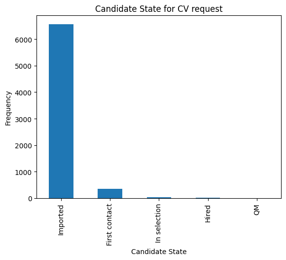

The majority of this candidates have "*imported*" as ``Candidate State``, which means that there's no way to evaluate their suitability.

.. parsed-literal::
    The 53.52% of the dataset \is composed of 'Imported' candidates that have \not sent their CV yet

**Event_feedback**
^^^^^^^^^^^^^^^^^^

This feature could be simplified with mapping, reducing the number of
possible values from 16 to 3:

.. parsed-literal::

    There are 16 possible values for <Event_Feedback>:
     ['OK' 'Not Specified' 'KO (technical skills)' 'OK (waiting for departure)'
     'KO (proposed renunciation)' 'OK (live)' 'KO (mobility)' 'KO (manager)'
     'KO (retired)' 'OK (hired)' 'KO (seniority)' 'KO (ral)'
     'OK (other candidate)' 'KO (opportunity closed)' 'KO (lost availability)'
     'KO (language skills)']

.. code:: python

    df['Event_Feedback'] = df['Event_Feedback'].apply(lambda x: 'OK' if 'OK' in x else x)
    df['Event_Feedback'] = df['Event_Feedback'].apply(lambda x: 'KO' if 'KO' in x else x)

.. parsed-literal::

    After mapping there are now 3 possible values \for <Event_Feedback>:
     ['OK' 'Not Specified' 'KO']

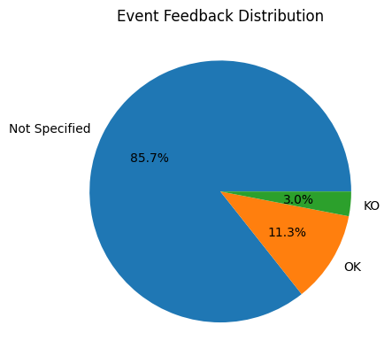

Data Visualization
------------------

**Sex and Candidate State**
~~~~~~~~~~~~~~~~~~~~~~~~~~~

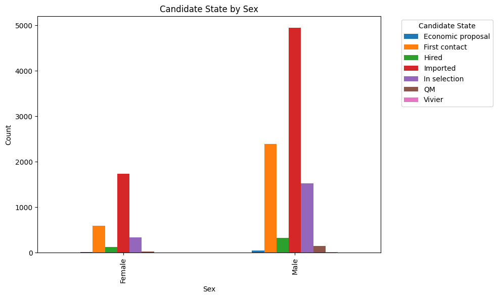

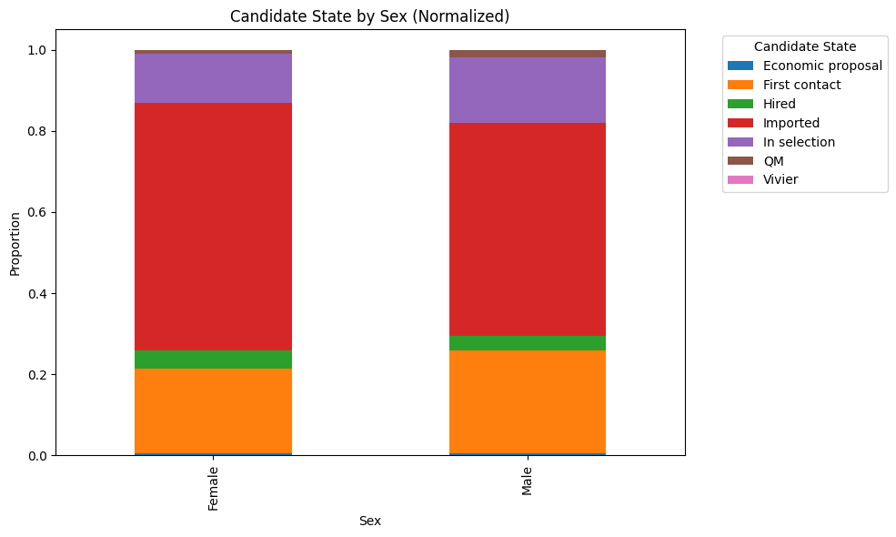

**Protected Category and Candidate State**
~~~~~~~~~~~~~~~~~~~~~~~~~~~~~~~~~~~~~~~~~~

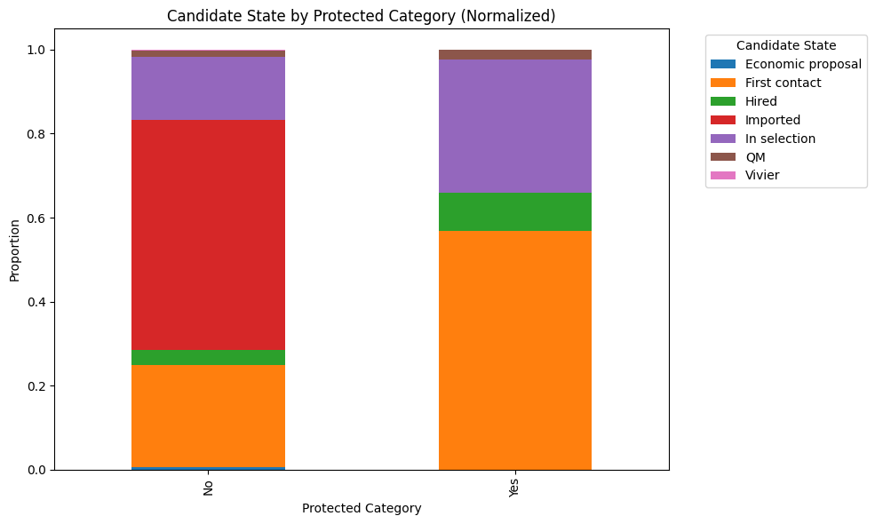

**Age Range and Candidate State**
~~~~~~~~~~~~~~~~~~~~~~~~~~~~~~~~~

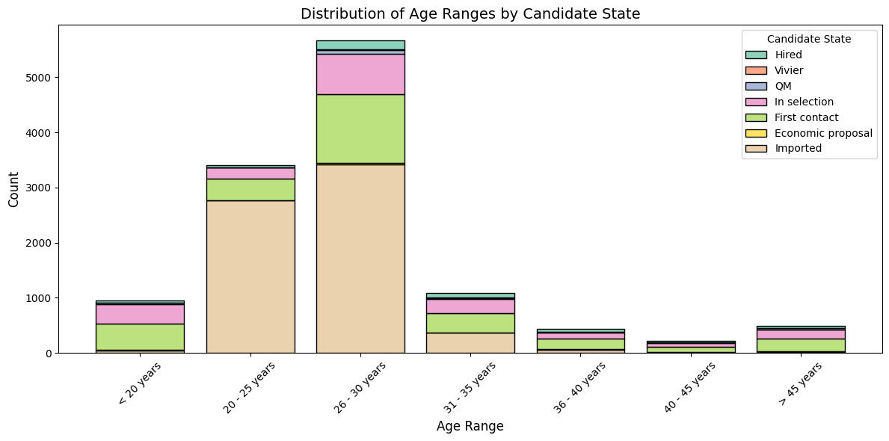

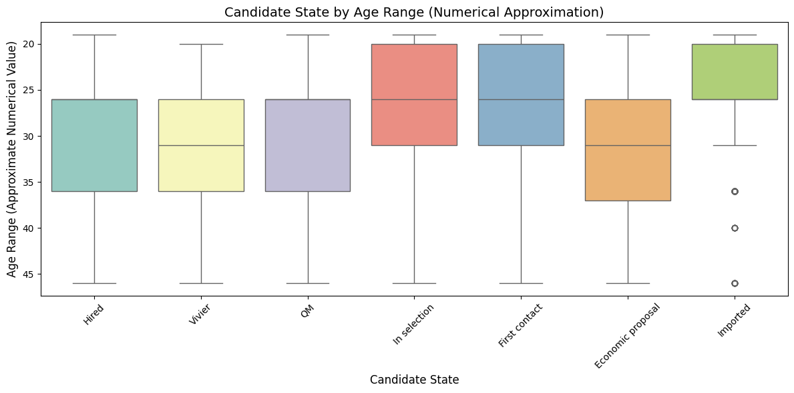

**Correlation**
~~~~~~~~~~~~~~~~

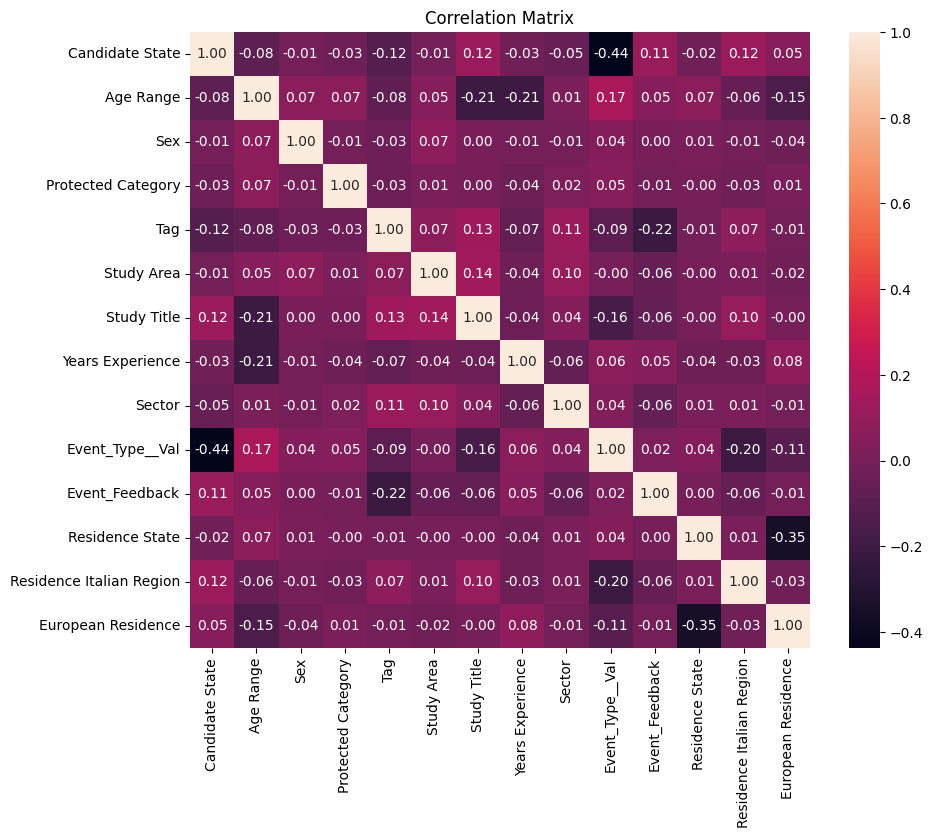

