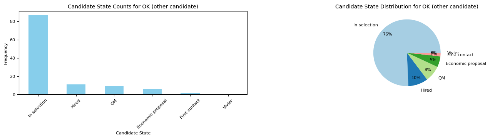
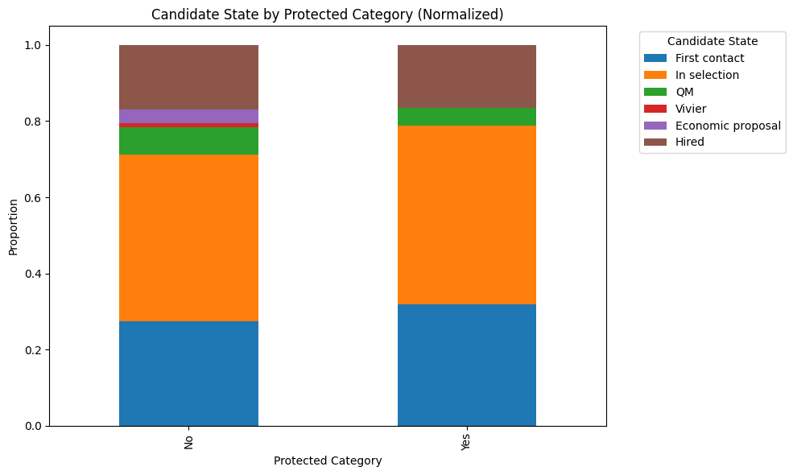
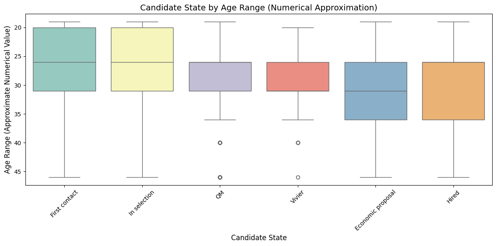
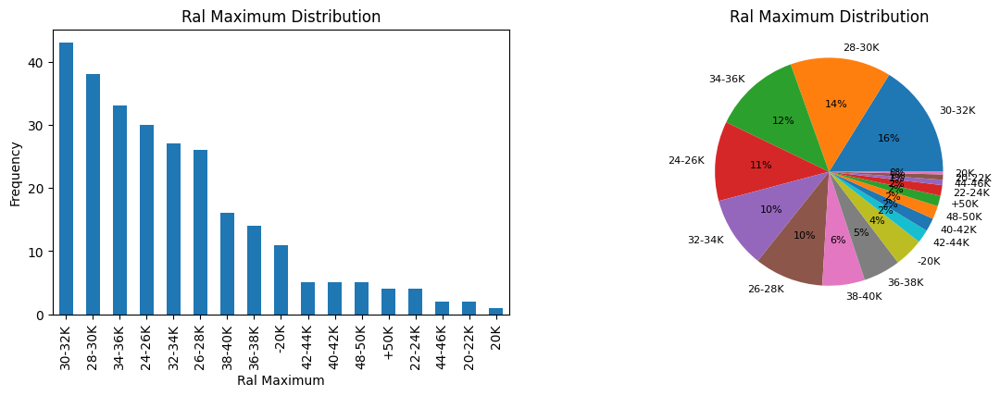

Dataset Analysis for AKKODIS
============================

.. contents:: Table of Contents
   :depth: 2
   :local:
   :backlinks: none

Overview
--------

The Akkodis Dataset consists of 40 columns and 21,277 entries. Each
candidate is identified by its ``ID`` and can appear in more than one
row, each one specific for an ``Event_type__val``.

.. parsed-literal::

    There are 12263 candidates in the dataset

Dataset Description
-------------------

Features
~~~~~~~~

The features can be divided in: \* **CANDIDATE FEATURES** \* **ID**:
unique identifier for the candidate \* **Candidate State**: status of
the candidate’s application \* ``Hired``: the candidate has been
selected \* ``Vivier``: the candidate’s skills do not correspond to the
requested skills, but will be taken in consideration for future
opportunities (**by who?** Akkodis \| the company) \* ``QM``:
Qualification Meeting \* ``In selection``: selection phase \*
``First contact``: the candidate has been contacted from the company for
the first time \* ``Economic proposal``: the company has made a proposal
to the candidate \* ``Imported``: the candidate has been transfered from
another DB **??**

Possible chronological orders for candidate status: \* ``In selection``
> ``First contact`` > ``QM`` > ``Economic Proposal`` > ``Hired``
(complete cycle with positive outcome) \* ``In selection`` >
``First contact`` > ``QM`` > ``Vivier`` \* ``In selection`` >
``First contact`` > ``QM`` (end of the selection process) \*
``In selection`` > ``First contact`` (end of the selection process
**WHY?**) \* **Age Range**: range of age for the candidate \* ``< 20``
\* ``20 - 25`` \* ``26 - 30`` \* ``31 - 35`` \* ``36 - 40`` \*
``40 - 45`` \* ``> 45`` \* **Residence**: current place of residence for
the candidate \* **Sex**: gender identification (``Male|Female``) \*
**Protected Category**: indicates if the candidate falls into a
protected category \* ``Article 1`` \* ``Article 18`` \* Not Specified
\* **TAG**: keywords used by recruiter \* **Study Area**: Field of study
or academic discipline of the candidate \* **Study Title**: Academic
degree or title obtained by the candidate \* ``Five-year degree`` \*
``Doctorate`` \* ``High school graduation`` \* ``Three-year degree`` \*
``master's degree`` \* ``Professional qualification`` \*
``Middle school diploma`` \* **Years Experience**: number of years of
professional experience of the candidate \* ``0`` \* ``0-1`` \* ``1-3``
\* ``3-5`` \* ``5-7`` \* ``7-10`` \* ``+10`` \* **Sector**: industry or
sector in which the candidate has experience \* **Last Role**:
candidate’s most recent job role \* **Year of Insertion**: year when the
candidate’s information was entered into the portal \* **Year of
Recruitment**: year in which the candidate was hired \* **Current Ral**:
current or existing salary \* **Expected Ral**: expected salary

Values present only if the candidate have moved forward in the
recruiting process: \* **Technical Skills**: skills related to technical
or specialized expertise from 1 to 4 \* **Standing/Position**: standing
or position within the organization from 1 to 4 **??** \*
**Comunication**: communication skills from 1 to 4 \* **Maturity**:
level of maturity from 1 to 4 \* **Dynamism**: level of Dynamism from 1
to 4 \* **Mobility**: mobility from 1 to 4 \* **English**: proficiency
in the English language from 1 to 4 \* **HIRING PROCESS FEATURES** \*
\**Event_type\__val\ **: It specifies the stage of the recruitment
process for the candidate \*** Event_feedback\ **: feedback received
from an event (``OK|KO``) \*** Overall\ **: overall assessment,
interview score \* ``1 - Low`` or ``~ 1 - Low`` \* ``2 - Medium`` or
``~ 2 - Medium`` \* ``3 - High`` or ``~ 3 - High`` \* ``4 - Top`` or
``~ 4 - Top`` \*** Akkodis headquarters\ **: headquarters location for
Akkodis \*** JOB POSITION FEATURES\ **: these features are present only
if the candidate has been hired \*** Recruitment Request\ **: represents
the application request for a candidacy \*** Assumption
Headquarters\ **: headquarters location associated with the hiring
assumption \*** Job Family Hiring\ **: Job family or category for the
hiring position \*** Job Title Hiring\ **: specific job title for the
hiring position \*** Job Description\ **: description of the job role
\*** Candidate Profile\ **: ideal profile information for the candidate,
requested by the company \*** Years Experience.1\ **: additional field
for specifying years of experience requested \*** Minimum Ral*\* (Gross
Annual Salary): minimum expected gross annual salary \* **Ral Maximum**:
maximum expected gross annual salary \* **Study Level**: level of study
requested for the job position, the values are equivalent to
``Study Title`` \* **Study Area.1**: additional field for specifying the
academic field of study requested \* **Linked_search_key**: indicates
the number of searches conducted for a job position

.. code:: python

    job_offer_columns = ['Recruitment Request', 'Assumption Headquarters', 'Job Family Hiring', 'Job Title Hiring',
                         'Job Description', 'Candidate Profile', 'Years Experience.1','Minimum Ral', 'Ral Maximum',
                         'Study Level', 'Study Area.1', 'Linked_Search__Key']

.. code:: python

    akkodis_col = ['Id','Akkodis Headquarters', 'Event_Feedback', 'Event_Type__Val', 'Overall']

.. code:: python

    candidate_col = ['Id', 'Age Range', 'Candidate State', 'Comunication', 'Dynamism', 'English',
           'Last Role', 'Maturity', 'Mobility', 'Protected Category', 'Residence',
           'Sector', 'Sex', 'Standing/Position', 'Study Area', 'Study Title',
           'Tag', 'Technical Skills', 'Year Of Insertion', 'Year Of Recruitment',
           'Years Experience', 'Current Ral', 'Expected Ral']

NaN Handling & Cleaning
-----------------------

.. code:: python

    numerical_cols = [ 'Id', 'Year Of Insertion', 'Year Of Recruitment', 'Overall', 'Technical Skills', 'Standing/Position', 'Comunication',
           'Maturity', 'Dynamism', 'Mobility', 'English']

.. code:: python

    #nan cleaning for job columns
    for col in job_offer_columns:
      if col != 'Linked_Search__Key':
        df[col] = df[col].replace([np.nan, ''], 'Not Specified')
        df[col] = df[col].str.lstrip()
        df[col] = df[col].str.rstrip()
        if col == 'Candidate Profile':
          df[col] = df[col].fillna('Not Specified')
          df[col] = df[col].replace([0, '.', '(coming soon)', '-', 'X', 'x', 'ok', 'anyone', 'replacement'], 'Not Specified')
        if col == 'Job Title Hiring':
          df[col] = df[col].replace('???', 'Not Specified')
        if col == 'Job Description':
          df[col] = df[col].replace(['.','ok','replacement'], 'Not Specified')
          df[col] = df[col].replace(['vivier','Vivier '], 'Vivier')
          df[col] = df[col].replace('INTERNSHIP', 'Internship')
        if 'Ral' in col:
          df[col] = df[col].replace(['Not Avail.', 'Not available'], 'Not Specified')
          df[col] = df[col].str.replace('- ','-')
          df[col] = df[col].str.replace('+ ','+')
        if col == 'Study Area.1':
          df[col] = df[col].replace('Other', 'Not Specified')
          df[col] = df[col].apply(lambda x: x.title() if isinstance(x, str) else x)
          df[col] = df[col].str.replace(' And ', ' and ')
        if col == 'Study Level':
          df[col] = df[col].apply(lambda x: x.title() if isinstance(x, str) else x)
        df[col] = df[col].str.lstrip()

.. code:: python

    df['Protected Category'] = df['Protected Category'].replace([np.nan, ''], 'No')

.. code:: python

    for col in df.columns:
      if col not in numerical_cols and col not in job_offer_columns:
        df[col] = df[col].replace([np.nan, ''], 'Not Specified')
        df[col] = df[col].str.lstrip()
        df[col] = df[col].str.rstrip()
        if col == 'Tag':
          df[col] = df[col].replace([',', '-', '.', '..', '., X','/', 'X' ], 'Not Specified') #assuming these values as default values
          df[col] = df[col].str.lstrip('-, ')
          df[col] = df[col].str.lstrip(',, ')
          df[col] = df[col].str.lstrip('., ')
          df[col] = df[col].str.lstrip('..., ')
          df[col] = df[col].str.lstrip('/, ')
          df[col] = df[col].str.rstrip(', X')
          df[col] = df[col].str.replace("'", "")
        if col == 'Last Role':
          df[col] = df[col].replace(['-', '.', '/', '????'], 'Not Specified')
          df[col] = df[col].replace(['NO', 'unemployed'], 'none')
        if 'Ral' in col:
          df[col] = df[col].replace(['Not Avail.', 'Not available'], 'Not Specified')
          df[col] = df[col].str.replace('- ','-')
          df[col] = df[col].str.replace('+ ','+')
          df[col] = df[col].str.replace(' K','K')
        if col == 'Study Title':
          df[col] = df[col].replace("master's degree", "Master's degree")
        if col == 'Study Area':
          df[col] = df[col].str.title()
          df[col] = df[col].str.replace(' And ', ' and ')
          df[col] = df[col].str.replace(' For ', ' for ')
          df[col] = df[col].str.replace(' The ', ' the ')
    

.. parsed-literal::

    Original values for <Year Of Insertion>: 
    ['[2018]' '[2019]' '[2020]' '[2021]' '[2022]' '[2023]']
    New values for <Year Of Insertion>: 
    [2018 2019 2020 2021 2022 2023]

.. parsed-literal::

    Original values for <Year Of Recruitment>: 
    ['[2021]' nan '[2018]' '[2019]' '[2022]' '[2020]' '[2023]' '[2024]']
    New values for <Year Of Recruitment>: 
    [2021.   nan 2018. 2019. 2022. 2020. 2023. 2024.]

.. parsed-literal::

    Original values for <Overall>:
     [nan '~ 2 - Medium' '~ 3 - High' '2 - Medium' '~ 4 - Top' '~ 1 - Low'
     '3 - High' '1 - Low' '4 - Top']
    New values for <Overall>:
     [nan  2.  3.  4.  1.]

.. parsed-literal::

    Unique values for <Year Of Recruitment>:
     [2021.0 'Not Specified' 2018.0 2019.0 2022.0 2020.0 2023.0 2024.0]
    Unique values for <Linked_Search__Key>:
     ['Not Specified' 'RS18.0145' 'RS18.0114' ... 'RS23.0021' 'RS23.0886'
     'RS23.0793']
    Unique values for <Overall>:
     ['Not Specified' 2.0 3.0 4.0 1.0]
    Unique values for <Technical Skills>:
     ['Not Specified' 2.0 3.0 1.0 4.0]
    Unique values for <Standing/Position>:
     ['Not Specified' 2.0 3.0 1.0 4.0]
    Unique values for <Comunication>:
     ['Not Specified' 1.0 2.0 3.0 4.0]
    Unique values for <Maturity>:
     ['Not Specified' 2.0 3.0 1.0 4.0]
    Unique values for <Dynamism>:
     ['Not Specified' 2.0 3.0 1.0 4.0]
    Unique values for <Mobility>:
     ['Not Specified' 3.0 2.0 1.0 4.0]
    Unique values for <English>:
     ['Not Specified' 3.0 4.0 2.0 1.0]

Custom order for categorical columns
------------------------------------

Candidate State
~~~~~~~~~~~~~~~

Possible chronological orders (*provided by Akkodis*) for candidate
status: \* ``In selection`` > ``First contact`` > ``QM`` >
``Economic Proposal`` > ``Hired`` (complete cycle with positive outcome)
\* ``In selection`` > ``First contact`` > ``QM`` > ``Vivier`` \*
``In selection`` > ``First contact`` > ``QM`` (end of the selection
process **negative outcome?**) \* ``In selection`` > ``First contact``
(end of the selection process **WHY?** (candidate not suitable \|
candidate’s choice))

**Based on statistics the order is more likely to be Imported > First
Contact > In selection …**

.. code:: python

    costum_order = ['Imported', 'First contact', 'In selection', 'QM', 'Vivier', 'Economic proposal', 'Hired']
    df['Candidate State'] = pd.Categorical(df['Candidate State'], categories=costum_order, ordered=True)

Age Range
~~~~~~~~~

.. code:: python

    custom_order = ['< 20 years', '20 - 25 years', '26 - 30 years',
                    '31 - 35 years', '36 - 40 years', '40 - 45 years', '> 45 years']
    df['Age Range'] = pd.Categorical(df['Age Range'], categories=custom_order, ordered=True)

Years Experience & Years Experience.1
~~~~~~~~~~~~~~~~~~~~~~~~~~~~~~~~~~~~~

.. code:: python

    custom_order = ['Not Specified', '[0]', '[0-1]', '[1-3]', '[3-5]', '[5-7]', '[7-10]', '[+10]']
    df['Years Experience'] = pd.Categorical(df['Years Experience'], categories=custom_order, ordered=True)
    df['Years Experience.1'] = pd.Categorical(df['Years Experience.1'], categories=custom_order, ordered=True)

RAL
~~~

.. parsed-literal::

    Minimum Ral custom order: ['Not Specified', '-20K', '20K', '20-22K', '22-24K', '24-26K', '26-28K', '28-30K', '30-32K', '32-34K', '34-36K', '36-38K', '38-40K', '40-42K', '+50K']
    Ral Maximum custom order: ['Not Specified', '-20K', '20K', '20-22K', '22-24K', '24-26K', '26-28K', '28-30K', '30-32K', '32-34K', '34-36K', '36-38K', '38-40K', '40-42K', '42-44K', '44-46K', '48-50K', '+50K']
    Current Ral custom order: ['Not Specified', '-20K', '20-22K', '22-24K', '24-26K', '26-28K', '28-30K', '30-32K', '32-34K', '34-36K', '36-38K', '38-40K', '40-42K', '42-44K', '44-46K', '46-48K', '48-50K', '+50K']
    Expected Ral custom order: ['Not Specified', '-20K', '20-22K', '22-24K', '24-26K', '26-28K', '28-30K', '30-32K', '32-34K', '34-36K', '36-38K', '38-40K', '40-42K', '42-44K', '44-46K', '46-48K', '48-50K', '+50K']

**Study Title**
~~~~~~~~~~~~~~~

Here is a possible order for ``Study Title``, based on academic
importance and chronological order:

1. **Middle school diploma** *(Basic level of compulsory education)*
2. **High school graduation** *(Pre-university level)*
3. **Professional qualification** *(Professional certification -
   specific non-academic training)*
4. **Three-year degree** *(Bachelor’s degree - first level of academic
   education)*
5. **Five-year degree** *(Master’s degree or single cycle - advanced
   academic training)*
6. **Master’s degree** *(Post-graduate master’s degree - professional or
   academic specialization)*
7. **Doctorate** *(Doctorate of research - highest level of academic
   education)*

.. code:: python

    costum_order = ['Middle school diploma', 'High school graduation', 'Professional qualification',
                    'Three-year degree', 'Five-year degree', 'Master\'s degree', 'Doctorate']

.. code:: python

    df['Study Title'] = pd.Categorical(df['Study Title'], categories=costum_order, ordered=True)

Feature Mapping
---------------

Feature mapping can be used to simplify the values in the dataset.

**Protected Category**
~~~~~~~~~~~~~~~~~~~~~~

.. parsed-literal::

    Original values for <Protected Category>:
     ['No' 'Article 1' 'Article 18']

.. parsed-literal::

    New values for <Protected Category>:
     ['No' 'Yes']

**Residence**
~~~~~~~~~~~~~

Mapping can be used to simplify this feature.

.. parsed-literal::

    List of residence states of the candidates in the dataset:
     ['ALBANIA', 'ALGERIA', 'ARGENTINA', 'AUSTRIA', 'BAHRAIN', 'BELARUS', 'BELGIUM', 'BRAZIL', 'BULGARIA', 'CHILE', "CHINA PEOPLE'S REPUBLIC", 'COLOMBIA', 'CROATIA', 'CZECH REPUBLIC', 'EGYPT', 'ERITREA', 'ETHIOPIA', 'FRANCE', 'GERMANY', 'GREAT BRITAIN-NORTHERN IRELAND', 'GREECE', 'GRENADA', 'HAITI', 'INDIA', 'INDONESIA', 'IRAN', 'ITALY', 'KAZAKHSTAN', 'KUWAIT', 'LEBANON', 'LIBYA', 'LITHUANIA', 'MALAYSIA', 'MALTA', 'MEXICO', 'MONACO', 'MOROCCO', 'NETHERLANDS', 'NIGERIA', 'OMAN', 'PAKISTAN', 'PHILIPPINES', 'PORTUGAL', 'QATAR', 'REPUBLIC OF POLAND', 'ROMANIA', 'RUSSIAN FEDERATION', 'SAINT LUCIA', 'SAINT PIERRE ET MIQUELON (ISLANDS)', 'SAN MARINO', 'SERBIA AND MONTENEGRO', 'SINGAPORE', 'SLOVAKIA', 'SOUTH AFRICAN REPUBLIC', 'SPAIN', 'SRI LANKA', 'SWEDEN', 'SWITZERLAND', 'SYRIA', 'TONGA', 'TUNISIA', 'Türkiye', 'UKRAINE', 'UNITED ARAB EMIRATES', 'UNITED STATES OF AMERICA', 'USSR', 'UZBEKISTAN', 'VENEZUELA', 'YUGOSLAVIA']

.. parsed-literal::

    List of residence italian regions of the candidates in the dataset:
     ['Abruzzo', 'Aosta Valley', 'Basilicata', 'Calabria', 'Campania', 'Emilia Romagna', 'Friuli Venezia Giulia', 'Lazio', 'Liguria', 'Lombardy', 'Marche', 'Molise', 'Not Specified', 'Piedmont', 'Puglia', 'Sardinia', 'Sicily', 'Trentino Alto Adige', 'Tuscany', 'Umbria', 'Veneto']

The values in the ``Residence`` column could be replaced with either the
*italian region* or the *state*.

To better define *residence* 3 new columns could be added:
``Residence State``, ``Residence Italian Region``,
``European Residence``. This kind of information needs to be protected
but should also be taken in consideration in order to ensure *Fairness*.

.. code:: python

    df['Residence State'] = df['Residence'].apply(lambda x: x if x in state_list else 'ITALY')

.. code:: python

    df['Residence Italian Region'] = df['Residence'].apply(lambda x: x if x in italy_list else 'Not in ITALY')

.. code:: python

    df.loc[
        (df['Residence State'] == 'ITALY') & (df['Residence Italian Region'] == 'Not in ITALY'),
        'Residence Italian Region'
    ] = 'Not Specified'

.. code:: python

    european_countries = [
        'AUSTRIA', 'BELGIUM', 'BULGARIA', 'CROATIA', 'CYPRUS', 'CZECH REPUBLIC', 'DENMARK', 'ESTONIA', 'FINLAND',
        'FRANCE', 'GERMANY', 'GREECE', 'IRELAND', 'HUNGARY', 'ITALY', 'LATVIA',
        'LITHUANIA', 'LUXEMBOURG', 'MALTA', 'NETHERLANDS', 'POLAND', 'PORTUGAL', 'ROMANIA', 'SLOVAKIA',
        'SLOVENIA', 'SPAIN', 'SWEDEN'
    ]
    df['European Residence'] = df['Residence State'].apply(lambda x: 'European' if x in european_countries else 'Non-European')

The ``Residence`` column could then be removed.

.. code:: python

    df = df.drop(columns=['Residence'])

**Last Role**
~~~~~~~~~~~~~

.. code:: python

    df['Last Role'] = df['Last Role'].str.title()
    df['Last Role'] = df['Last Role'].str.replace('Software', 'Sw')
    df['Last Role'] = df['Last Role'].str.replace('Hardware', 'Hw')
    df['Last Role'] = df['Last Role'].str.replace('Trainee', 'Intern')
    df['Last Role'] = df['Last Role'].str.replace('Pm', 'Project Manager')

.. code:: python

    #neo, engaged, 'Rc20.02904'
    last_role_mapping = {
        'Aerospace Eng': 'Aerospace Engineer',
        'Are Managers': 'Area Manager',
        'Back End Developer': 'Backend Developer',
        'Back-End Developer': 'Backend Developer',
        'Civil Cad Engineer': 'Civil Engineer',
        'Civil Engineer Fez': 'Civil Engineer',
        'Consulting': 'Consultant',
        'Cost Control': 'Cost Controller',
        'Data Analysis': 'Data Analyst',
        'Data Scientist': 'Data Scientists',
        'Design': 'Designer',
        'Doctoral Student': 'Doctorate',
        'Post-Doc': 'Doctorate',
        'Freelance': 'Freelancer',
        'Front End Developer': 'Frontend Developer',
        'Front-End Developer': 'Frontend Developer',
        'Fresh Graduate': 'Graduate',
        'Graduate Student': 'Graduate',
        'Graduated': 'Graduate',
        'Graduated 2023': 'Graduate',
        'Graduated July 2023': 'Graduate',
        'Recent Three-Year Graduate': 'Graduate',
        'New Graduate March 2023': 'Graduate',
        "Master'S Degree Graduate October 2023": 'Graduate',
        'Graduated October 2023': 'Graduate',
        'Graduating 2023': 'Graduating',
        'Graduating Student': 'Graduating',
        'Help Desk': 'Helpdesk Operator',
        'Hr Generalist -': 'Hr Generalist',
        "I'M Waiting For Cv": 'Not Specified',
        'Internship': 'Intern',
        'Intern/Trainee': 'Intern',
        'Internships': 'Intern',
        'It Consulting': 'It Consultant',
        "Master'S Degree": "Master'S Graduate",
        "Recent Master'S Graduate": "Master'S Graduate",
        "Master'S Student": "Master'S Graduate",
        'New Graduate': 'Graduate',
        'Newly Graduated Student': 'Graduate',
        'Recent Graduate': 'Graduate',
        'Graduate Student - Has Never Worked In The Sector': 'Graduate',
        'Nobody': 'None',
        'Ph.D': 'Phd',
        'Phd Candidates': 'Phd',
        'Ph.D Student': 'Phd Student',
        'Project Design': 'Project Designer',
        'Project Engineer,': 'Project Engineer',
        'Project Engineering': 'Project Engineer',
        'Project Managerr&D': 'Project Manager',
        'Recruiters': 'Recruiter',
        'Researchers': 'Researcher',
        'Salesperson': 'Sales',
        'Sw Design': 'Sw Designer',
        'Sw Engineer |': 'Sw Engineer',
        'Student In Physics': 'Student',
        'Students': 'Student',
        'Student Assistant': 'Students Tutor',
        'Supporting Engineer': 'Support Engineer',
        'Systems Engineer': 'Systems Engineer',
        'Substitute Teacher': 'Teacher',
        'Test Eng': 'Test Engineer',
        'Tester Engineer': 'Test Engineer',
        'Testers': 'Tester',
        'Testing': 'Tester',
        'Thesis Internship': 'Thesis Intern',
        'Thesis Student': 'Student',
        'Thesis Trainee': 'Thesis Intern',
        'Three-Year Student': 'Student',
        'Web Masters': 'Webmaster',
        'Unemployed': 'None'
    }

Possible Target Variables
-------------------------

Some possible target variables in this dataset could be:

- **Possible RAL**: a new column that predicts the adequate RAL for the
  candidate profile. However the dataset contains very few samples with
  RAL values specified:

.. parsed-literal::

    98.09% of candidates have no Minimum Ral specified
    0.02% of candidates have multiple Minimum Ral specified
    97.50% of candidates have no Ral Maximum specified
    0.02% of candidates have multiple Ral Maximum specified
    92.85% of candidates have no Current Ral specified
    0.05% of candidates have multiple Current Ral specified
    93.74% of candidates have no Expected Ral specified
    0.05% of candidates have multiple Expected Ral specified

- **Eligibility**: defines whether a candidate is eligible for each
  macro-sector served by Akkodis, based on the information provided.
  Since the job offer is only present if the candidate has been hired,
  we will consider only hired candidates as eligible, while we must
  distinguish between candidates who have not been selected (‘*Not
  eligible*’) and candidates who have not gone ahead with the recruiting
  process, who therefore cannot be evaluated.

.. parsed-literal::

    0.00% of candidates have no Id specified
    0.00% of candidates have no Candidate State specified
    0.00% of candidates have no Age Range specified
    0.00% of candidates have no Sex specified
    0.00% of candidates have no Protected Category specified
    77.89% of candidates have no Tag specified
    0.31% of candidates have no Study Area specified
    0.00% of candidates have no Study Title specified
    0.00% of candidates have no Years Experience specified
    57.92% of candidates have no Sector specified
    58.37% of candidates have no Last Role specified
    0.00% of candidates have no Year Of Insertion specified
    95.96% of candidates have no Year Of Recruitment specified
    96.56% of candidates have no Recruitment Request specified
    95.97% of candidates have no Assumption Headquarters specified
    95.97% of candidates have no Job Family Hiring specified
    96.23% of candidates have no Job Title Hiring specified
    11.20% of candidates have no Event_Type__Val specified
    77.67% of candidates have no Event_Feedback specified
    77.06% of candidates have no Linked_Search__Key specified
    75.59% of candidates have no Overall specified
    96.62% of candidates have no Job Description specified
    96.72% of candidates have no Candidate Profile specified
    96.53% of candidates have no Years Experience.1 specified
    98.09% of candidates have no Minimum Ral specified
    97.50% of candidates have no Ral Maximum specified
    96.53% of candidates have no Study Level specified
    96.95% of candidates have no Study Area.1 specified
    96.53% of candidates have no Akkodis Headquarters specified
    92.85% of candidates have no Current Ral specified
    93.74% of candidates have no Expected Ral specified
    75.65% of candidates have no Technical Skills specified
    75.63% of candidates have no Standing/Position specified
    75.63% of candidates have no Comunication specified
    75.63% of candidates have no Maturity specified
    75.64% of candidates have no Dynamism specified
    75.62% of candidates have no Mobility specified
    75.68% of candidates have no English specified
    0.00% of candidates have no Residence State specified
    0.21% of candidates have no Residence Italian Region specified
    0.00% of candidates have no European Residence specified

.. parsed-literal::

    0.00% of candidates have multiple Id specified
    5.23% of candidates have multiple Candidate State specified
    5.84% of candidates have multiple Age Range specified
    2.61% of candidates have multiple Sex specified
    0.04% of candidates have multiple Protected Category specified
    0.51% of candidates have multiple Tag specified
    7.60% of candidates have multiple Study Area specified
    4.56% of candidates have multiple Study Title specified
    4.09% of candidates have multiple Years Experience specified
    0.99% of candidates have multiple Sector specified
    1.37% of candidates have multiple Last Role specified
    5.54% of candidates have multiple Year Of Insertion specified
    0.14% of candidates have multiple Year Of Recruitment specified
    0.04% of candidates have multiple Recruitment Request specified
    0.01% of candidates have multiple Assumption Headquarters specified
    0.07% of candidates have multiple Job Family Hiring specified
    0.07% of candidates have multiple Job Title Hiring specified
    23.65% of candidates have multiple Event_Type__Val specified
    7.80% of candidates have multiple Event_Feedback specified
    6.08% of candidates have multiple Linked_Search__Key specified
    5.63% of candidates have multiple Overall specified
    0.09% of candidates have multiple Job Description specified
    0.12% of candidates have multiple Candidate Profile specified
    0.04% of candidates have multiple Years Experience.1 specified
    0.02% of candidates have multiple Minimum Ral specified
    0.02% of candidates have multiple Ral Maximum specified
    0.02% of candidates have multiple Study Level specified
    0.04% of candidates have multiple Study Area.1 specified
    0.02% of candidates have multiple Akkodis Headquarters specified
    0.05% of candidates have multiple Current Ral specified
    0.05% of candidates have multiple Expected Ral specified
    6.01% of candidates have multiple Technical Skills specified
    6.36% of candidates have multiple Standing/Position specified
    6.77% of candidates have multiple Comunication specified
    6.87% of candidates have multiple Maturity specified
    7.43% of candidates have multiple Dynamism specified
    7.53% of candidates have multiple Mobility specified
    4.70% of candidates have multiple English specified
    0.44% of candidates have multiple Residence State specified
    6.65% of candidates have multiple Residence Italian Region specified
    0.36% of candidates have multiple European Residence specified

We can assume that if a candidate doesn’t have a ``Sector`` value
specified there’s not enough information to evaluate them. The majority
of candidates that do not have a value specified for ``Sector`` have
‘Imported’ or ‘First contact’ as ``Candidate State``, which are the
first stages of the recruiting process. This explains why this kind of
samples do not have enough informations and therefore should not be
considered as “NOT suitable”.

For these candidates, no competence score is even specified.

For all the reasons mentioned above we can choose for now to discard all
candidates without specified ``Sector`` values:

.. parsed-literal::

    Number of removed rows: 9163 (42.86%)

Sample Sorting
--------------

To ensure that the last row for each candidate is the most recent one we
can sort the dataset: \* by **ID**: rows of the same candidate will be
near \* by **Year Of Insertion**: If a candidate have more than one
value for this column the rows will be chronologically ordered \* by
**Year Of Recruitment**: If a candidate have more than one value for
this column (i.e. has been hired multiple times) the rows will be
chronologically ordered \* by **Candidate State**: to reflect the normal
hiring process order of events

.. code:: python

    #sorting
    df = df.sort_values(by=['Id', 'Year Of Insertion', 'Year Of Recruitment', 'Candidate State'], ascending=[True, True, True, True], kind='mergesort', na_position='first')
    df = df.reset_index(drop=True)

**Data Cleaning**
-----------------

Check for inconsistencies in the data. ### Candidates with multiple
``Candidate State``

.. parsed-literal::

    1.98% of candidates have multiple <Candidate State> specified

The majority of the candidates have a single value for
``Candidate State``, with less than 2% with multiple candidate states.

It looks like different people with the same ``Id``. We can choose the
last value for ``Candidate State`` (which will be the most useful one
since we sorted the dataset) as valid and consider the other rows as
errors.

.. parsed-literal::

              Id Candidate State   Sex      Age Range Residence Italian Region     Residence State  
    144      946   First contact  Male  26 - 30 years                   Veneto           ITALY    
    145      946    In selection  Male  26 - 30 years                   Sicily           ITALY   
    146      946    In selection  Male  26 - 30 years                   Sicily           ITALY   
    147      946    In selection  Male  26 - 30 years                   Sicily           ITALY    
    148      946    In selection  Male  26 - 30 years                   Sicily           ITALY    
    ...      ...             ...   ...            ...                      ...             ...    
    12145  81271    In selection  Male     < 20 years                 Piedmont           ITALY   
    12146  81271    In selection  Male     < 20 years                 Piedmont           ITALY   
    12166  81418   First contact  Male     < 20 years             Not in ITALY         TUNISIA    
    12167  81418    In selection  Male  26 - 30 years                   Puglia           ITALY   
    12168  81418    In selection  Male  26 - 30 years                   Puglia           ITALY     

    [558 rows x 6 columns]

.. parsed-literal::

    Number of removed rows: 289 (2.37%)

Candidates with multiple ``Year Of Insertion``
~~~~~~~~~~~~~~~~~~~~~~~~~~~~~~~~~~~~~~~~~~~~~~

.. parsed-literal::

    0.83% of candidates have more than one value for <Year Of Insertion>

.. parsed-literal::

              Id  Year Of Insertion   Sex      Age Range Residence Italian Region
    136      889               2021  Male  31 - 35 years                 Piedmont
    137      889               2022  Male  26 - 30 years                 Lombardy
    138      889               2022  Male  26 - 30 years                 Lombardy
    139      889               2022  Male  26 - 30 years                 Lombardy
    140      889               2022  Male  26 - 30 years                 Lombardy
    ...      ...                ...   ...            ...                      ...
    11928  79664               2022  Male  26 - 30 years                   Puglia
    11929  79664               2022  Male  26 - 30 years                   Puglia
    11930  79664               2022  Male  26 - 30 years                   Puglia
    12065  80646               2022  Male     > 45 years                    Lazio
    12066  80646               2023  Male  26 - 30 years                   Sicily
    
    [192 rows x 5 columns]

.. parsed-literal::

    25.58% of candidates that have multiple <Year Of Insertion> have also more than one <Sex> specified
    83.72% of candidates that have multiple <Year Of Insertion> have also more than one <Age Range> specified
    0.00% of candidates that have multiple <Year Of Insertion> have also more than one <Protected Category> specified

1% of candidates have multiple values for ``Year Of Insertion``. 25% of
candidates that have more than one ``Year Of Insertion`` also have
different values specified for ``Sex`` while 80% have different values
specified for ``Age Range``. This could mean that different candidates
could have the same ``Id`` by mistake. However we can consider the most
recent ``Year Of Insertion`` in the Akkodis database as valid and
discard the other entries:

.. parsed-literal::

    Number of removed rows: 98 (0.82%)

Candidates with multiple ``Year Of Recruitment``
~~~~~~~~~~~~~~~~~~~~~~~~~~~~~~~~~~~~~~~~~~~~~~~~

.. parsed-literal::

    0.25% of candidates have more than one value for <Year Of Recruitment>

Since less than 1% of candidates have more than one values for
``Year Of Recruitment`` we can assume this cases as noise and keep the
most recent one.

.. parsed-literal::

    Number of removed rows: 64 (0.54%)

Columns that are unlikely to change
~~~~~~~~~~~~~~~~~~~~~~~~~~~~~~~~~~~

We can check again if any candidate changes ``Sex``, ``Age Range`` or
``Protected Category``:

.. parsed-literal::

    0.19% of candidates have multiple Sex specified
    0.45% of candidates have multiple Age Range specified
    0.00% of candidates have multiple Protected Category specified

We can consider as noise multiple values for ``Sex`` and keep the most
recent one as valid.

.. parsed-literal::

    Number of removed rows: 17 (0.14%)

.. parsed-literal::

    0.33% of candidates still have multiple Age Range specified

We need to check if the age change is due to time or noise:

.. code:: python

    age_range_order = {
        '< 20 years': 1,
        '20 - 25 years': 2,
        '26 - 30 years': 3,
        '31 - 35 years': 4,
        '36 - 40 years': 5,
        '40 - 45 years': 6,
        '> 45 years': 7
    }

.. parsed-literal::

    There are 17 (0.33%) candidates that become younger

100% of candidates with different values for ``Age Range`` are not
coherent with the time, as they are becoming younger. Of these
candidates we can keep the last value of ``Age Range`` as valid and
discard the other entries:

.. parsed-literal::

    Number of removed rows: 23 (0.20%)

.. parsed-literal::

    The value of Study Area changes in 12 rows (0.10%), 3 candidates (0.06%)
    Index([25959, 61260, 77070], dtype='int64', name='Id')
    
    
    
    The value of Study Title changes in 2 rows (0.02%), 1 candidates (0.02%)
    Index([61260], dtype='int64', name='Id')
    
    
    
    The value of Years Experience changes in 7 rows (0.06%), 2 candidates (0.04%)
    Index([61260, 77070], dtype='int64', name='Id')
    
    
    
    The value of Sector changes in 5 rows (0.04%), 1 candidates (0.02%)
    Index([25959], dtype='int64', name='Id')

Unuseful columns 
--------------------
``Linked_Search__Key`` 
~~~~~~~~~~~~~~~~~~~~~~~
This feature could have
a huge impact in the analysis since it’s specific for each job position
and can be found also in candidates that were not hired for a specific
position.

.. parsed-literal::

    51.25% of candidates have no <Linked_Search__Key> specified

.. parsed-literal::

    12.48% of candidates have multiple <Linked_Search__Key> specified

Multiple values of ``Linked_Search__Key`` could have different meanings:
- different values after ``.`` as the search for the same position is
going on and so the number of searches is increasing - the candidate is
being evaluated for different positions

.. parsed-literal::

    7.31% of candidates who have multiple <Linked_Search__Key> also have multiple <Linked_Search__Key___Prefix> specified

Even if ``Linked_Search__Key`` “indicates the number of searches
conducted for a job position”,unfortunately it does not contain any
unique identifier for the job position as the only values before ``.``
are:

.. parsed-literal::

    ['RS18' 'RS19' 'RS20' 'RS21' 'RS22' 'RS23' 'RS24']

The number between ``RS`` and ``.`` could be the ‘Year Of Insertion’ of
the Job Position **??**

45% of candidates with no job position specified have
``Linked_Search__Key``.

.. parsed-literal::

    55.56% of candidates that have <Job Title Hiring> not specified have no <Linked_Search__Key> specified
    
    
    10.63% of candidates that have <Job Title Hiring> not specified have multiple <Linked_Search__Key> specified

For each hired candidate, ``Linked_Search__Key`` is specified, with 35%
having more than one value, but less than 20% having more than one value
for the prefix.

.. parsed-literal::

    0.00% of candidates that have <Job Title Hiring> specified have no <Linked_Search__Key> specified
    
    
    34.59% of candidates that have <Job Title Hiring> specified have multiple <Linked_Search__Key> specified

Some entries contains ``Linked_Search__Key`` values in the
``Recruitment Request`` field:

.. parsed-literal::

    60 recruitment requests contain <Linked_Search__key> values:
     ['RS18.0258 - Aerospace Engineering Nursery'
     'RS18.0351 - Junior Recruiter' 'RS18.0438 - C++ / QT - Urgent'
     'RS18.0470 - Brake Measurement Eng.' 'RS18.0519 - Team Manager'
     'RS18.0583 - Business Manager' 'RS18.0655 - ASIC DESIGNER'
     'RS18.0661 - Infotainment Test Engineer'
     'RS18.0670 - Junior Project Manager' 'RS18.0684 - Airworthiness Engineer'
     'RS18.0744 - BM AMAS - Bologna'
     'RS18.0798 - Project Engineer/Project Manager'
     'RS18.0824 - Hardware IoT Designer' 'RS18.0889 - SW Engineer Linux'
     'RS19.0060 - OFFICE INTERNSHIP. ACQUISITIONS'
     'RS19.0061  - C++ / QT - VERY Urgent' 'RS19.0095 - SW designers'
     'RS19.0107 - Vivier Electronics' 'RS19.0130 - Junior System Engineer'
     'RS19.0138 - Mechanical designer (Automotive/Aeronautics/Industries)'
     'RS19.0179 - Java Developer' 'RS19.0186 - HR CURRICULAR INTERN - BOLOGNA'
     'RS19.0200 - Drilling and Completion Supervisor'
     'RS19.0207 - Process Engineer'
     'RS19.0223 - JUNIOR MODEL ENGINEER AUTOMOTIVE'
     'RS19.0227 - Hardware Engineer' 'RS19.0263 - MTG Stage'
     'RS19.0279 - P/L data handling engineering & AIV'
     'RS19.0295 - Computer System Validation Consultant - Milan'
     'RS19.0298 - Assessment Center - AKKA Modena - 02/05/2019'
     'RS19.0308 - Model Based Design -Engineer'
     'RS19.0314 - Project Software Engineer (C++)'
     'RS19.0318 - Resident Engineer' 'RS19.0319 - QHSE Manager'
     'RS19.0340 - Space Internship' 'RS19.0409 - I&C Planner'
     'RS19.0491 - Business Manager' 'RS19.0499 - Business Manager'
     'RS19.0501 -  Buyer - AKKA Office' 'RS19.0501 -Buyer'
     'RS19.0534 - Key Account Manager' 'RS19.0600 - SW Engineer C++'
     'RS19.0649  - Commissioning Team' 'RS19.0674 - HW qualification testing'
     'RS19.0688 - Piping Supervisor - EST Europe'
     'RS19.0703 - Piping Supervisor - Udine workshop'
     'RS19.0741 - HR Recruiter' 'RS19.0763 - Commissioning Manager'
     'RS19.0787 - Risk and Loss Prevention Engineer'
     'RS19.0793 - Software Developer' 'RS19.0811 - Test System Engineer'
     'RS19.0832 - PROCESS ENGINEER & REFINERY UTILITIES'
     'RS19.0839 - Thermoengineering - Technical Team - Milan'
     'RS19.0865 - Team Procurement - Milan'
     'RS19.0865 -Team Procurement - Milan'
     'RS19.1029 - Product Assurance Procurement'
     'RS19.1046 - Payroll Specialist'
     'RS19.1048 - Senior Mission/Ground Engineer'
     'RS20.0255 - Maintenance Team Leader'
     'RS20.0299 - Quality Control Document Technician Support']

After the above considerations we can discard the column and remove its
values ​​from ``Recruitment Request``.

After the data cleaning we have removed:

.. parsed-literal::

    Total number of removed rows: 9662 (45.20%)

**Job Positions**
-----------------

The job position is specified only for candidates who have been hired
for that position. The other candidates have no information regarding
the position for which they were not selected.

.. parsed-literal::

    0 candidates have a specified position but have not been hired

.. parsed-literal::

    243 candidates have 'Hired' as <Candidate State> but have no <Recruitment Request> specified
    7 candidates have 'Hired' as <Candidate State> but have no <Assumption Headquarters> specified
    7 candidates have 'Hired' as <Candidate State> but have no <Job Family Hiring> specified
    97 candidates have 'Hired' as <Candidate State> but have no <Job Title Hiring> specified
    267 candidates have 'Hired' as <Candidate State> but have no <Job Description> specified
    318 candidates have 'Hired' as <Candidate State> but have no <Candidate Profile> specified
    232 candidates have 'Hired' as <Candidate State> but have no <Years Experience.1> specified
    1041 candidates have 'Hired' as <Candidate State> but have no <Minimum Ral> specified
    722 candidates have 'Hired' as <Candidate State> but have no <Ral Maximum> specified
    232 candidates have 'Hired' as <Candidate State> but have no <Study Level> specified
    409 candidates have 'Hired' as <Candidate State> but have no <Study Area.1> specified

7 candidates (0.05%) have no job position specified but have ‘Hired’ as
``Candidate State``. Since there is no way to know for which position
they were eligible we can discard them.

.. parsed-literal::

    Number of removed rows: 12

We can assume that each candidate has only one job position specified,
if hired. Only 0.06% of hired candidates have more than one job position
specified.

.. parsed-literal::

    3 (0.06%) candidates have multiple 'Job Title Hiring' specified

Looking at the three candidates in question we can see that they do not
have multiple positions specified, they only have duplicate rows with
small differences:

.. parsed-literal::

           Id   Job Title Hiring Job Family Hiring  \
    513  3472         Technician       Engineering   
    514  3472  Junior Consultant       Engineering   
    515  3472         Technician       Engineering   
    516  3472  Junior Consultant       Engineering   
    517  3472         Technician       Engineering   
    518  3472  Junior Consultant       Engineering   
    519  3472         Technician       Engineering   
    520  3472  Junior Consultant       Engineering   
    
                             Job Description         Event_Type__Val  
    513  New ing graduates available in Pisa  Candidate notification  
    514  New ing graduates available in Pisa  Candidate notification  
    515  New ing graduates available in Pisa  Candidate notification  
    516  New ing graduates available in Pisa  Candidate notification  
    517  New ing graduates available in Pisa            BM interview  
    518  New ing graduates available in Pisa            BM interview  
    519  New ing graduates available in Pisa            BM interview  
    520  New ing graduates available in Pisa            BM interview  
    
     
    
             Id   Job Title Hiring Job Family Hiring  \
    4832  32188         Technician       Engineering   
    4833  32188  Junior Consultant       Engineering   
    4834  32188         Technician       Engineering   
    4835  32188  Junior Consultant       Engineering   
    4836  32188         Technician       Engineering   
    4837  32188  Junior Consultant       Engineering   
    
                                            Job Description Event_Type__Val  
    4832                                      Not Specified    Contact note  
    4833  The candidate will be responsible for • Requir...    Contact note  
    4834                                      Not Specified    BM interview  
    4835  The candidate will be responsible for • Requir...    BM interview  
    4836                                      Not Specified    BM interview  
    4837  The candidate will be responsible for • Requir...    BM interview  
    
     
    
              Id     Job Title Hiring            Job Family Hiring  \
    11360  75854           Consultant  Tech Consulting & Solutions   
    11361  75854  Advanced Consultant  Tech Consulting & Solutions   
    11362  75854           Consultant  Tech Consulting & Solutions   
    11363  75854  Advanced Consultant  Tech Consulting & Solutions   
    11364  75854           Consultant  Tech Consulting & Solutions   
    11365  75854  Advanced Consultant  Tech Consulting & Solutions   
    
                                             Job Description      Event_Type__Val  
    11360  The candidate will be responsible for the FEM ...  Technical interview  
    11361  The candidate will be responsible for the FEM ...  Technical interview  
    11362  The candidate will be responsible for the FEM ...         BM interview  
    11363  The candidate will be responsible for the FEM ...         BM interview  
    11364  The candidate will be responsible for the FEM ...         HR interview  
    11365  The candidate will be responsible for the FEM ...         HR interview  
    

In the dataset there are now 300 different *Job Offers* specified and
400 candidates hired for them. Each position has at least 1 hired
candidate and some have more than one.

.. parsed-literal::

    In the dataset there are 429 (8.32%) hired candidates and 303 different 'Job Description' specified

New Cleaned Dataset
-------------------

.. code:: python

    new_path = dataset_path.replace('.xlsx', '_cleaned.xlsx')
    df.to_excel(new_path, index=False)
    
    files.download(new_path)

Feature Analysis
-----------------

**``Candidate State``**
~~~~~~~~~~~~~~~~~~~~~~~

**``Age Range``**
~~~~~~~~~~~~~~~~~

**``Sex``**
~~~~~~~~~~~

The dataset is unbalanced with respect to Sex feature, with 80% male
candidates and 20% female candidates.

**``Protected Category``**
~~~~~~~~~~~~~~~~~~~~~~~~~~

The dataset is highly unbalanced with respect to this feature, with only
0.9% candidates from protected categories.

**``Tag``**
~~~~~~~~~~~

This feature is highly irregular and will need processing in order to be
useful. Some mapping could be applied to clean the data:

.. parsed-literal::

    ['Not Specified' 'PROJECT MANAGEMENT' 'ANGULAR, JAVASCRIPT.' ...
     'DATA ANALYST, EMBEDDED SOFTWARE ENGINEER'
     'CAD, FEM, REQVIEW, SYSTEM, SYSTEM ENGINEER' 'OFFICE, EXCEL, MS PROJECT']

.. raw:: html

    
      

        

    
    <table border="1" class="dataframe">
      <thead>
        <tr style="text-align: right;">
          <th></th>
          <th>Keyword</th>
          <th>Count</th>
        </tr>
      </thead>
      <tbody>
        <tr>
          <th>8</th>
          <td>MATLAB</td>
          <td>534</td>
        </tr>
        <tr>
          <th>10</th>
          <td>C++</td>
          <td>303</td>
        </tr>
        <tr>
          <th>28</th>
          <td>C</td>
          <td>289</td>
        </tr>
        <tr>
          <th>22</th>
          <td>SOLIDWORKS</td>
          <td>286</td>
        </tr>
        <tr>
          <th>93</th>
          <td>SIMULINK</td>
          <td>285</td>
        </tr>
        <tr>
          <th>142</th>
          <td>PYTHON</td>
          <td>272</td>
        </tr>
        <tr>
          <th>13</th>
          <td>JAVA</td>
          <td>171</td>
        </tr>
        <tr>
          <th>15</th>
          <td>EXCEL</td>
          <td>170</td>
        </tr>
        <tr>
          <th>16</th>
          <td>OFFICE</td>
          <td>143</td>
        </tr>
        <tr>
          <th>23</th>
          <td>AUTOCAD</td>
          <td>121</td>
        </tr>
      </tbody>
    </table>
    

        

    
      

        <button class="colab-df-convert" onclick="convertToInteractive('df-09d5bd69-3a0b-42d8-ba74-3f3628b0926a')"
                title="Convert this dataframe to an interactive table."
                style="display:none;">
    
      <svg xmlns="http://www.w3.org/2000/svg" height="24px" viewBox="0 -960 960 960">
        <path d="M120-120v-720h720v720H120Zm60-500h600v-160H180v160Zm220 220h160v-160H400v160Zm0 220h160v-160H400v160ZM180-400h160v-160H180v160Zm440 0h160v-160H620v160ZM180-180h160v-160H180v160Zm440 0h160v-160H620v160Z"/>
      </svg>
        </button>
    
      
    
        
      

    
    
    

      <button class="colab-df-quickchart" onclick="quickchart('df-dd7239c4-6779-4f8e-a2ac-8c329587d049')"
                title="Suggest charts"
                style="display:none;">
    
    <svg xmlns="http://www.w3.org/2000/svg" height="24px"viewBox="0 0 24 24"
         width="24px">
        <g>
            <path d="M19 3H5c-1.1 0-2 .9-2 2v14c0 1.1.9 2 2 2h14c1.1 0 2-.9 2-2V5c0-1.1-.9-2-2-2zM9 17H7v-7h2v7zm4 0h-2V7h2v10zm4 0h-2v-4h2v4z"/>
        </g>
    </svg>
      </button>
    
    
    
      
    

    
        

      

**``Study Area``**
~~~~~~~~~~~~~~~~~~

.. parsed-literal::

    There are 47 different <Study Area> values:
     ['Industrial Engineering' 'Electrical Engineering'
     'Civil/Civil and Environmental Engineering' 'Communication Sciences'
     'Management Engineering' 'Scientific Maturity' 'Electronic Engineering'
     'Informatics' 'Mechanical Engineering' 'Biomedical Engineering'
     'Information Engineering' 'Computer Engineering'
     'Automation/Mechatronics Engineering' 'Chemical Engineering' 'Other'
     'Psychology' 'Accounting' 'Automotive Engineering'
     'Aeronautical/Aerospace/Astronautics Engineering'
     'Other Scientific Subjects'
     'Engineering for the Environment and the Territory'
     'Chemist - Pharmaceutical' 'Economic - Statistics' 'Legal'
     'Safety Engineering' 'Energy and Nuclear Engineering'
     'Other Humanities Subjects' 'Telecommunications Engineering'
     'Political-Social' 'Surveyor' 'Medical' 'Naval Engineering'
     'Humanistic High School Diploma' 'Architecture' 'Literary'
     'Materials Science and Engineering' 'Linguistics' 'Statistics'
     'Mathematics' 'Geo-Biological' 'Physical Education' 'Artistic'
     'Construction Engineering' 'Petroleum Engineering'
     'Mathematical-Physical Modeling for Engineering' 'Defense and Security'
     'Agriculture and Veterinary'] 
    

**``Study Title``**
~~~~~~~~~~~~~~~~~~~

.. parsed-literal::

    There are 7 different <Study Title> values:
     ['Five-year degree' 'Three-year degree' 'High school graduation'
     "Master's degree" 'Doctorate' 'Middle school diploma'
     'Professional qualification'] 
    

**``Years Experience``**
~~~~~~~~~~~~~~~~~~~~~~~~

.. parsed-literal::

    There are 7 different <Years Experience> categories:
     ['[1-3]' '[+10]' '[0-1]' '[0]' '[5-7]' '[3-5]' '[7-10]'] 
    

**``Sector``**
~~~~~~~~~~~~~~

This feature doesn’t seem relevant as its most frequent value is
“*Others*”.

**``Last Role``**
~~~~~~~~~~~~~~~~~

.. image:: Akkodis_Dataset_Analysis_files/Akkodis_Dataset_Analysis_203_0.png

.. raw:: html

    
      

        

    
    <table border="1" class="dataframe">
      <thead>
        <tr style="text-align: right;">
          <th></th>
          <th>Keyword</th>
          <th>Count</th>
        </tr>
      </thead>
      <tbody>
        <tr>
          <th>7</th>
          <td>Engineer</td>
          <td>1134</td>
        </tr>
        <tr>
          <th>25</th>
          <td>Graduate</td>
          <td>635</td>
        </tr>
        <tr>
          <th>31</th>
          <td>Student</td>
          <td>437</td>
        </tr>
        <tr>
          <th>16</th>
          <td>Manager</td>
          <td>387</td>
        </tr>
        <tr>
          <th>47</th>
          <td>Sw</td>
          <td>316</td>
        </tr>
        <tr>
          <th>20</th>
          <td>Developer</td>
          <td>274</td>
        </tr>
        <tr>
          <th>24</th>
          <td>Master'S</td>
          <td>247</td>
        </tr>
        <tr>
          <th>15</th>
          <td>Project</td>
          <td>244</td>
        </tr>
        <tr>
          <th>93</th>
          <td>Graduating</td>
          <td>223</td>
        </tr>
        <tr>
          <th>14</th>
          <td>Designer</td>
          <td>196</td>
        </tr>
      </tbody>
    </table>
    

        

    
      

        <button class="colab-df-convert" onclick="convertToInteractive('df-7ad0cba0-5392-49ba-ac20-8669dc733167')"
                title="Convert this dataframe to an interactive table."
                style="display:none;">
    
      <svg xmlns="http://www.w3.org/2000/svg" height="24px" viewBox="0 -960 960 960">
        <path d="M120-120v-720h720v720H120Zm60-500h600v-160H180v160Zm220 220h160v-160H400v160Zm0 220h160v-160H400v160ZM180-400h160v-160H180v160Zm440 0h160v-160H620v160ZM180-180h160v-160H180v160Zm440 0h160v-160H620v160Z"/>
      </svg>
        </button>
    
      
    
        
      

    
    
    

      <button class="colab-df-quickchart" onclick="quickchart('df-32f7c1d8-ba85-4b53-9f1f-74c818824c23')"
                title="Suggest charts"
                style="display:none;">
    
    <svg xmlns="http://www.w3.org/2000/svg" height="24px"viewBox="0 0 24 24"
         width="24px">
        <g>
            <path d="M19 3H5c-1.1 0-2 .9-2 2v14c0 1.1.9 2 2 2h14c1.1 0 2-.9 2-2V5c0-1.1-.9-2-2-2zM9 17H7v-7h2v7zm4 0h-2V7h2v10zm4 0h-2v-4h2v4z"/>
        </g>
    </svg>
      </button>
    
    
    
      
    

    
        

      

**``Year Of Insertion``**
~~~~~~~~~~~~~~~~~~~~~~~~~

**``Year Of Recruitment``**
~~~~~~~~~~~~~~~~~~~~~~~~~~~

**``Event_type__val``**
~~~~~~~~~~~~~~~~~~~~~~~

A possible chronological order could be useful to maintain only the last
event.

.. parsed-literal::

    There are 14 different values for <Event_Type__Val:
     ['Not Specified' 'Research association' 'BM interview' 'CV request'
     'Contact note' 'HR interview' 'Commercial note' 'Candidate notification'
     'Sending SC to customer' 'Technical interview' 'Economic proposal'
     'Inadequate CV' 'Qualification Meeting' 'Notify candidate']

**``Event Feedback``**
~~~~~~~~~~~~~~~~~~~~~~

There are many possible ``Event_Feedback`` in the dataset:

- OK

  - other candidate: the candidate was not hired because the company
    chose someone else (**but were them suitable?**)
  - live: **??**
  - waiting for departure: **??**
  - hired: the candidate is suitable for the position

- KO

  - manager: **??**
  - technical skills: the candidate’s skills are not suitable for the
    position
  - mobility: the candidate is not suitable for mobility reason, not
    related to skills **?**
  - retired: the candidate retired **?? (Should we keep them??)**
  - seniority: the candidate is too old \| not enough senior **??**
  - ral: candidate expected higher ral **??**
  - opportunity closed: the candidate was not hired because the
    opportunity closed, *maybe similar to ``OK (other candidate)``*
    (**but were them suitable?**)
  - proposed renunciation: the candidate has renounced the proposal,
    **but was suitable**
  - language skills: the candidate was not hired due to lack of language
    skills
  - lost availability: **of who?? the candidate?**

It might be useful to distinguish between positive and negative
outcomes. For example, KO (ral) does not mean that the candidate was
unsuitable, however we do not have the position that was offered to
them. **Should we discard these cases??**

.. parsed-literal::

    Possible values for <Event_Feedback>: 
     ['Not Specified' 'OK' 'KO (manager)' 'OK (other candidate)' 'OK (live)'
     'KO (technical skills)' 'KO (mobility)' 'KO (retired)' 'KO (seniority)'
     'KO (ral)' 'KO (opportunity closed)' 'KO (proposed renunciation)'
     'OK (waiting for departure)' 'KO (language skills)'
     'KO (lost availability)' 'OK (hired)']

Not Specified
^^^^^^^^^^^^^^
Half of the candidates have no ``Event_Feedback``
specified.

.. parsed-literal::

    52.60% of candidates have 'Not Specified' in every row as <Event_Feedback>

Looking at the histogram below we can see that the majority of
candidates who have no ``Event_Feedback`` specified (in every row) have
‘First Contact’ as ``Candidate State``. This means that they are in the
first stages of the recruiting process and so they don’t have any
feedback.

Looking at the distribution of ``Event_Type__Val`` among candidates for
whom ``Event_Feedback`` is not specified, we can see that most of them
have ‘Contact note’ and ‘CV request’.

OK
^^

.. parsed-literal::

    1747 (33.88%) candidates have 'OK' as Event_Feedback 
    (in at least one row)
    
    
    76.59% of candidates (1338) with 'OK' (in at least one row) have no Job Position specified
     
    
    

OK (other candidate)
^^^^^^^^^^^^^^^^^^^^

Only 2% of candidates have ‘Ok (other candidate)’ as ``Event_Feedback``.
80% of those have ‘In Selection’ as ``Candidate State``. This means that
during the *Selection* phase another candidate was selected to continue
the hiring process **??**. 90% have no *Job Position* specified.

.. parsed-literal::

    115 (2.23%) candidates have 'OK (other candidate)' as Event_Feedback 
    (in at least one row)
    
    
    90.43% of candidates (104) with 'OK (other candidate)' (in at least one row) have no Job Position specified
     
    

OK (live)
^^^^^^^^^

15% of candidates have ‘Ok (live)’ as ``Event_Feedback``. 90% of those
have no *Job Position* specified and **80**\ % are still ‘in selection’.

.. parsed-literal::

    728 (14.12%) candidates have 'OK (live)' as Event_Feedback 
    (in at least one row)
    
    
    89.84% of candidates (654) with 'OK (live)' (in at least one row) have no Job Position specified
     
    

OK (waiting for departure)
^^^^^^^^^^^^^^^^^^^^^^^^^^

This seems to mean that the candidate is suitable for the position and
they are waiting to be hired. However 15% (19) of candidates that have
this feedback have no job position specified.

.. parsed-literal::

    123 (2.39%) candidates have 'OK (waiting for departure)' as Event_Feedback 
    (in at least one row)
    
    
    15.45% of candidates (19) with 'OK (waiting for departure)' (in at least one row) have no Job Position specified
     
    

OK (hired)
^^^^^^^^^^

.. parsed-literal::

    16 (0.31%) candidates have 'OK (hired)' as Event_Feedback 
    (in at least one row)
    
    
    6.25% of candidates (1) with 'OK (hired)' (in at least one row) have no Job Position specified
     

KO (manager)
^^^^^^^^^^^^

.. parsed-literal::

    224 (4.34%) candidates have 'KO (manager)' as Event_Feedback 
    (in at least one row)
    
    
    97.77% of candidates (219) with 'KO (manager)' (in at least one row) have no Job Position specified
    

KO (technical skills)
^^^^^^^^^^^^^^^^^^^^^

.. parsed-literal::

    186 (3.61%) candidates have 'KO (technical skills)' as Event_Feedback 
    (in at least one row)
    
    
    93.55% of candidates (174) with 'KO (technical skills)' (in at least one row) have no Job Position specified
     

KO (mobility)
^^^^^^^^^^^^^

.. parsed-literal::

    48 (0.93%) candidates have 'KO (mobility)' as Event_Feedback 
    (in at least one row)
    
    
    95.83% of candidates (46) with 'KO (mobility)' (in at least one row) have no Job Position specified
   

KO (retired)
^^^^^^^^^^^^

.. parsed-literal::

    60 (1.16%) candidates have 'KO (retired)' as Event_Feedback 
    (in at least one row)
    
    
    100.00% of candidates (60) with 'KO (retired)' (in at least one row) have no Job Position specified
     

40% of candidates with ‘KO (retired)’ ``Event_Feedback`` have [26-30]
years **??** However less than 2% of the candidates has received this
feedback.

KO (seniority)
^^^^^^^^^^^^^^

.. parsed-literal::

    49 (0.95%) candidates have 'KO (seniority)' as Event_Feedback 
    (in at least one row)
    
    
    95.92% of candidates (47) with 'KO (seniority)' (in at least one row) have no Job Position specified
     

KO (ral)
^^^^^^^^

This feedback could mean that the ral was not enough for the candidates.
However almost every one of them have no *Job position* specified.

.. parsed-literal::

    29 (0.56%) candidates have 'KO (ral)' as Event_Feedback 
    (in at least one row)
    
    
    96.55% of candidates (28) with 'KO (ral)' (in at least one row) have no Job Position specified
     
  
.. image:: Akkodis_Dataset_Analysis_files/Akkodis_Dataset_Analysis_251_1.png

KO (Closed Opportunity)
^^^^^^^^^^^^^^^^^^^^^^^

This does not necessarily mean that the candidate was not suitable for
the position, however, since most of these candidates do not have a
specified position, they will be considered ineligible.

.. parsed-literal::

    29 (0.56%) candidates have 'KO (opportunity closed)' as Event_Feedback 
    (in at least one row)
    
    
    93.10% of candidates (27) with 'KO (opportunity closed)' (in at least one row) have no Job Position specified
     

KO (proposed renunciation)
^^^^^^^^^^^^^^^^^^^^^^^^^^

.. parsed-literal::

    53 (1.03%) candidates have 'KO (proposed renunciation)' as Event_Feedback 
    (in at least one row)
    
    
    94.34% of candidates (50) with 'KO (proposed renunciation)' (in at least one row) have no Job Position specified
   

.. image:: Akkodis_Dataset_Analysis_files/Akkodis_Dataset_Analysis_256_3.png

KO (language skills)
^^^^^^^^^^^^^^^^^^^^

.. parsed-literal::

    18 (0.35%) candidates have 'KO (language skills)' as Event_Feedback 
    (in at least one row)
    
    
    100.00% of candidates (18) with 'KO (language skills)' (in at least one row) have no Job Position specified
     
  

KO (lost availability)
^^^^^^^^^^^^^^^^^^^^^^

.. parsed-literal::

    13 (0.25%) candidates have 'KO (lost availability)' as Event_Feedback 
    (in at least one row)
    
    
    100.00% of candidates (13) with 'KO (lost availability)' (in at least one row) have no Job Position specified
   

**``Overall``**
~~~~~~~~~~~~~~~

**``Current Ral``**
~~~~~~~~~~~~~~~~~~~

**``Expected Ral``**
~~~~~~~~~~~~~~~~~~~~

**``Technical Skills``**
~~~~~~~~~~~~~~~~~~~~~~~~

**``Standing/Position``**
~~~~~~~~~~~~~~~~~~~~~~~~~

**``Comunication``**
~~~~~~~~~~~~~~~~~~~~

**``Maturity``**
~~~~~~~~~~~~~~~~

**``Dynamism``**
~~~~~~~~~~~~~~~~

**``Mobility``**
~~~~~~~~~~~~~~~~

**``English``**
~~~~~~~~~~~~~~~

**``European Residence``**
~~~~~~~~~~~~~~~~~~~~~~~~~~

**``Residence State``**
~~~~~~~~~~~~~~~~~~~~~~~

**``Residence Italian Region``**
~~~~~~~~~~~~~~~~~~~~~~~~~~~~~~~~

Data Visualization
------------------

**Sex and Candidate State**
~~~~~~~~~~~~~~~~~~~~~~~~~~~

**Protected Category and Candidate State**
~~~~~~~~~~~~~~~~~~~~~~~~~~~~~~~~~~~~~~~~~~

**Age Range and Candidate State**
~~~~~~~~~~~~~~~~~~~~~~~~~~~~~~~~~

**Correlation**
~~~~~~~~~~~~~~~

Job Offers dataset
------------------

.. parsed-literal::

    There are 391 job offers

.. raw:: html

    
      

        

    
    <table border="1" class="dataframe">
      <thead>
        <tr style="text-align: right;">
          <th></th>
          <th>Recruitment Request</th>
          <th>Assumption Headquarters</th>
          <th>Job Family Hiring</th>
          <th>Job Title Hiring</th>
          <th>Job Description</th>
          <th>Candidate Profile</th>
          <th>Years Experience.1</th>
          <th>Minimum Ral</th>
          <th>Ral Maximum</th>
          <th>Study Level</th>
          <th>Study Area.1</th>
        </tr>
      </thead>
      <tbody>
        <tr>
          <th>0</th>
          <td>Front End Developer</td>
          <td>Bologna</td>
          <td>Tech Consulting &amp; Solutions</td>
          <td>Consultant</td>
          <td>Web Developer – 03/06/23 • Have 2+ years of ex...</td>
          <td>Web Developer – 03/06/23 • Have 2+ years of ex...</td>
          <td>[1-3]</td>
          <td>22-24K</td>
          <td>28-30K</td>
          <td>Three-Year Degree</td>
          <td>Informatics</td>
        </tr>
        <tr>
          <th>1</th>
          <td>Powertrain Calibration Engineer</td>
          <td>Modena</td>
          <td>Engineering</td>
          <td>Junior Consultant</td>
          <td>For our PWT Team in the Emilia area we are loo...</td>
          <td>Ideal candidates have a master's degree in Mec...</td>
          <td>[0-1]</td>
          <td>Not Specified</td>
          <td>24-26K</td>
          <td>Five-Year Degree</td>
          <td>Automotive Engineering</td>
        </tr>
        <tr>
          <th>2</th>
          <td>Not Specified</td>
          <td>Modena</td>
          <td>Engineering</td>
          <td>Consultant</td>
          <td>Not Specified</td>
          <td>Not Specified</td>
          <td>Not Specified</td>
          <td>Not Specified</td>
          <td>Not Specified</td>
          <td>Not Specified</td>
          <td>Not Specified</td>
        </tr>
        <tr>
          <th>3</th>
          <td>Team Procurement - Milan</td>
          <td>Milan</td>
          <td>Engineering</td>
          <td>Not Specified</td>
          <td>1 coordinator 1 senior buyer 1 junior buyer</td>
          <td>1 coordinator 1 senior buyer 1 junior buyer</td>
          <td>[0]</td>
          <td>Not Specified</td>
          <td>Not Specified</td>
          <td>Professional Qualification</td>
          <td>Not Specified</td>
        </tr>
        <tr>
          <th>4</th>
          <td>HW, SW, Networking MOS&amp;TGGS Support</td>
          <td>Turin</td>
          <td>Engineering</td>
          <td>Consultant</td>
          <td>A. configuration of HW, Middleware, SW and net...</td>
          <td>VmWare VSphere, RedHat Linux OS Knowledge of n...</td>
          <td>[3-5]</td>
          <td>28-30K</td>
          <td>32-34K</td>
          <td>Three-Year Degree</td>
          <td>Computer Engineering</td>
        </tr>
      </tbody>
    </table>
    

        

    
      

        <button class="colab-df-convert" onclick="convertToInteractive('df-1de3054b-06b8-461a-b7e5-08fae547fd5f')"
                title="Convert this dataframe to an interactive table."
                style="display:none;">
    
      <svg xmlns="http://www.w3.org/2000/svg" height="24px" viewBox="0 -960 960 960">
        <path d="M120-120v-720h720v720H120Zm60-500h600v-160H180v160Zm220 220h160v-160H400v160Zm0 220h160v-160H400v160ZM180-400h160v-160H180v160Zm440 0h160v-160H620v160ZM180-180h160v-160H180v160Zm440 0h160v-160H620v160Z"/>
      </svg>
        </button>
    
      
    
        
      

    
    
    

      <button class="colab-df-quickchart" onclick="quickchart('df-976cb162-418d-483e-99c8-83245144a295')"
                title="Suggest charts"
                style="display:none;">
    
    <svg xmlns="http://www.w3.org/2000/svg" height="24px"viewBox="0 0 24 24"
         width="24px">
        <g>
            <path d="M19 3H5c-1.1 0-2 .9-2 2v14c0 1.1.9 2 2 2h14c1.1 0 2-.9 2-2V5c0-1.1-.9-2-2-2zM9 17H7v-7h2v7zm4 0h-2V7h2v10zm4 0h-2v-4h2v4z"/>
        </g>
    </svg>
      </button>
    
    
    
      
    

    
        

      

.. parsed-literal::

    There are 0 (0.00%) 'Not Specified' for <Assumption Headquarters>
    
    

.. parsed-literal::

    
    
    
    There are 0 (0.00%) 'Not Specified' for <Job Family Hiring>
    
    

.. parsed-literal::

    
    
    
    There are 21 (5.37%) 'Not Specified' for <Job Title Hiring>
    
    

.. parsed-literal::

    
    
    
    There are 21 (5.37%) 'Not Specified' for <Years Experience.1>
    
    

.. parsed-literal::

    
    
    
    There are 189 (48.34%) 'Not Specified' for <Minimum Ral>
    
    

.. parsed-literal::

    
    
    
    There are 125 (31.97%) 'Not Specified' for <Ral Maximum>
    
    

.. parsed-literal::

    
    
    
    There are 21 (5.37%) 'Not Specified' for <Study Level>
    
    

.. parsed-literal::

    
    
    
    There are 67 (17.14%) 'Not Specified' for <Study Area.1>
    
    

.. parsed-literal::

    
    
    

.. code:: python

    job_path = 'Dataset_2.0_Akkodis_Job_Offers.xlsx'
    job_offers_df.to_excel(job_path, index=False)
    files.download(job_path)
